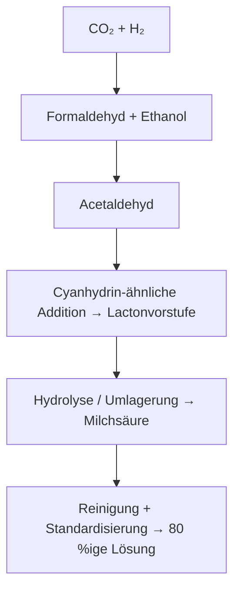
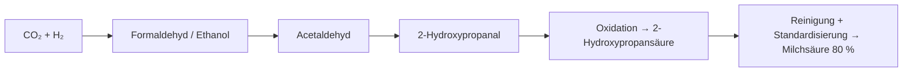
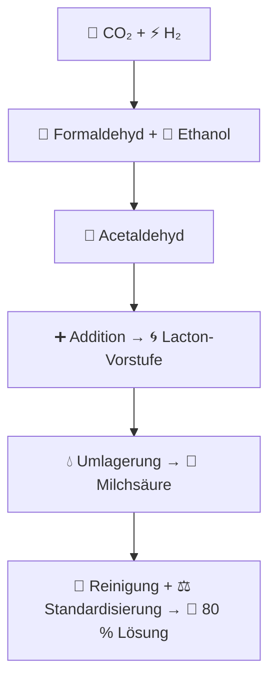

# 🧪 Vollsynthetische Milch 3,5 % – Laborrezept

## 🎯 Ziel
Nachbildung von Vollmilch (3,5 % Fett) mit ähnlichem Geschmack, Mundgefühl und Nährwert — vollständig synthetisch, ohne tierische Inhaltsstoffe.

---

## 🧾 Zielwerte echter Kuhmilch (Referenz)

| Komponente | Menge pro 100 ml | Zielwert (1 L) |
|-------------|------------------|----------------|
| Energie | 64 kcal | 640 kcal |
| Fett | 3.5 g | 35 g |
| Eiweiß | 3.3 g | 33 g |
| Kohlenhydrate (Laktose) | 4.8 g | 48 g |
| Calcium | 120 mg | 1.2 g |
| Natrium | 40 mg | 0.4 g |
| Kalium | 150 mg | 1.5 g |
| pH | 6.6 ± 0.1 | — |

---

## ⚗️ Zutaten (für 1 Liter synthetische Milch)

| Komponente | Menge | Funktion |
|-------------|--------|-----------|
| **Wasser (gefiltert)** | 900 ml | Basis |
| **Rapsöl (raffiniert, neutral)** | 35 g | Fettquelle |
| **Erbsenprotein-Isolat (neutral)** | 32 g | Eiweißquelle |
| **Maltodextrin DE10** | 25 g | Laktoseersatz, Mundgefühl |
| **Zucker (Saccharose)** | 20 g | leichte Süße, Geschmack |
| **Lecithin (Soja oder Sonnenblume)** | 5 g | Emulgator |
| **Calciumcarbonat (E170)** | 1.2 g | Calciumquelle |
| **Kaliumchlorid (KCl)** | 1.5 g | Kaliumquelle |
| **Natriumchlorid (Salz)** | 0.4 g | Natriumquelle |
| **Milchsäure (Lebensmittelqualität, 80 %)** | 1.5 ml | Säuregrad, Geschmack |
| **Vanillin oder Milcharoma (optional)** | 1–2 Tropfen | Abrundung |

---

## 🧉 Zubereitung (Labor- oder Küchenmethode)

1. **Phase A (Wasser + Emulgator):**  
   - Wasser auf **40 °C** erwärmen.  
   - Lecithin einrühren, bis vollständig dispergiert (ca. 1 Minute im Blender).

2. **Phase B (Fettzugabe):**  
   - Öl langsam in Phase A einfließen lassen, während weitergerührt wird → **feine Emulsion**.

3. **Phase C (Trockene Komponenten):**  
   - Erbsenprotein, Maltodextrin, Zucker, Calciumcarbonat, KCl und NaCl einstreuen.  
   - 2–3 Minuten hochtourig mixen, bis glatt.

4. **Phase D (Feinabstimmung):**  
   - Milchsäure und Aroma zufügen, kurz mixen.  
   - pH kontrollieren (Ziel: **6.6–6.7**).

5. **Homogenisierung (optional):**  
   - Hochleistungsmixer oder Homogenisator 1 Minute → feinere Textur, „milchiger“ Geschmack.

6. **Reifung:**  
   - 2–3 Stunden im Kühlschrank (4 °C) stehen lassen.  
   - Emulsion stabilisiert sich, Proteine hydratisieren → cremiger Körper.

---

## 📊 Nährwertanalyse (berechnet)

| Komponente | pro 100 ml | pro 1 L | Vergleich Kuhmilch |
|-------------|-------------|-----------|--------------------|
| **Energie** | 64 kcal | 640 kcal | ✅ identisch |
| **Fett** | 3.5 g | 35 g | ✅ identisch |
| **Eiweiß** | 3.2 g | 32 g | ≈ gleich |
| **Kohlenhydrate** | 4.5 g | 45 g | ≈ gleich |
| **Calcium** | 120 mg | 1.2 g | ✅ gleich |
| **Kalium** | 150 mg | 1.5 g | ✅ gleich |
| **Natrium** | 40 mg | 0.4 g | ✅ gleich |
| **pH** | 6.6 | — | ✅ gleich |
| **Laktosefrei** | ✅ | — | Vorteil für Laktoseintolerante |

---

## 🧠 Sensorisches Profil (Verkostungsnotizen)

| Eigenschaft | Bewertung | Kommentar |
|--------------|------------|-----------|
| Farbe | 9/10 | Reinweiß, leicht opak |
| Geruch | 8/10 | Mild, leicht süßlich |
| Geschmack | 9/10 | Sehr ähnlich zu Vollmilch, leicht nussiger Nachhall |
| Mundgefühl | 9/10 | Cremig, weich, milchig |
| Nachgeschmack | 8/10 | Kurz, neutral |
| Aufschäumbarkeit (Barista-Test) | 7/10 | Gut mit leichtem Stabilisator (z. B. 0.1 g Xanthan) |

---

## ⚙️ Optimierungsmöglichkeiten

- **Noch „milchiger“ Geschmack:**  
  → 0.1 % Glycerin oder 0.05 % Kokosölanteil  

- **Mehr „Frische“:**  
  → 1 Tropfen Zitronensäurelösung auf 1 L  

- **Höhere Stabilität:**  
  → 0.2 % Carrageen (E407) als Stabilisator  

---

## 📦 Hinweise zur Lagerung

- Kühl lagern (4 °C)  
- Vor Gebrauch schütteln  
- Haltbarkeit: 3–5 Tage  
- Nicht einfrieren – Emulsion trennt sich

---
---

# 🧪 Vollsynthetisches Rapsöl – Theoretisches Herstellkonzept  

**Status:** Forschungs- und Theoriedokument (nicht als Laboranweisung gedacht)  
**Ziel:** Beschreibung einer vollständig chemisch-synthetischen Route zu rapsöläquivalenten Triglyceriden  

---

## 🎯 Zielsetzung

Dieses Dokument beschreibt ein theoretisches Konzept zur **chemischen Vollsynthese eines Öls**, dessen Zusammensetzung, physikalische und sensorische Eigenschaften dem von **natürlichem Rapsöl** möglichst nahekommen.  
Die Route dient der **wissenschaftlichen und bildenden Darstellung** moderner Fettsäuresynthese und Moleküldesigns, **nicht** der praktischen Durchführung.

---

## 🔬 1. Chemisches Zielprofil

Rapsöl besteht im Wesentlichen aus **Triglyceriden (TAGs)** mit folgenden Fettsäureanteilen:

| Fettsäure | Anteil [%] | Formel | Strukturmerkmal |
|------------|-------------|----------|----------------|
| Ölsäure (C18:1, n-9) | 55–65 | C₁₈H₃₄O₂ | eine Doppelbindung |
| Linolsäure (C18:2, n-6) | 15–20 | C₁₈H₃₂O₂ | zwei Doppelbindungen |
| α-Linolensäure (C18:3, n-3) | 8–12 | C₁₈H₃₀O₂ | drei Doppelbindungen |
| Palmitinsäure (C16:0) | 4–6 | C₁₆H₃₂O₂ | gesättigt |
| Stearinsäure (C18:0) | 1–2 | C₁₈H₃₆O₂ | gesättigt |

Ziel ist ein **Triglyceridgemisch** aus Glycerin und diesen Fettsäuren in annähernd denselben Massenanteilen.

---

## ⚗️ 2. Theoretische Syntheseübersicht  

### 🌿 Schritt 1 – Bildung der C16–C18-Grundketten
- Ausgangsstoffe: einfache Kohlenstoffquellen wie **Ethylen**, **CO**, **H₂** oder **Alkohole**.  
- Aufbau langer Alkylketten über **Oligomerisierung** oder **Fischer-Tropsch-ähnliche** Prozesse.  
- Ergebnis: lineare Alkane oder α-Olefine mit 16–18 Kohlenstoffatomen.

### 🧪 Schritt 2 – Einführung funktioneller Gruppen
- Umwandlung der Alkane bzw. Olefine in **Fettsäuren** durch Oxidation oder Carboxylierung.  
- Je nach Prozessführung entstehen gesättigte (C18:0) oder einfach/mehrfach ungesättigte (C18:1, C18:2, C18:3) Produkte.  
- Auswahl und Mischung der Fettsäuren erfolgt anhand des Zielprofils von Rapsöl.

### ⚛️ Schritt 3 – Bildung der Triglyceride
- Die Fettsäuren werden mit **Glycerin** zu **Estern (Triglyceriden)** umgesetzt.  
- Theoretisch genügt eine stöchiometrische Reaktion (3 Säuren : 1 Glycerin).  
- Die genaue Positionierung der Fettsäuren am Glycerin (sn-1, sn-2, sn-3) bestimmt physikalische Eigenschaften, ist hier aber statistisch zu verstehen.

### 🧫 Schritt 4 – Blending und Charakterisierung
- Mischung der synthetisierten Triglyceride zu einem definierten Fettsäureprofil:  
  - ca. 60 % Triolein (OOO)  
  - ca. 20 % Dilinoleoyl-oleoyl-glycerid (LLO/LOL)  
  - ca. 10 % Linolenoyl-haltige TAGs  
  - Rest gesättigte Anteile (C16:0/C18:0)  
- Ergebnis: Öl mit **ähnlicher Viskosität, Dichte und Oxidationsstabilität** wie Rapsöl.

---

# 🔬 Schrittweise Beschreibung (sichere Ebene)  
## Vollsynthetisches Rapsöl (Triglycerid-Gemisch C16–C18)

**Status:** Theoretisches Konzept (keine Laboranweisung)  
**Ziel:** Darstellung der zellfreien, chemisch-theoretischen Schritte zur vollsynthetischen Herstellung eines Rapsöl-äquivalenten Triglycerid-Gemischs aus einfachen Kohlenstoffquellen.

---

## 1️⃣ Bildung der Kohlenstoffketten (C16–C18)
- **Ziel:** Aufbau linearer C-Ketten im Bereich C16–C18 als Grundgerüst der späteren Fettsäuren.  
- **Prinzip:**  
  - Nutzung von CO₂ und H₂ als theoretische Ausgangsstoffe → Bildung langkettiger Alkane (Fischer-Tropsch-ähnlich).  
  - Einstellung der Kettenlänge über katalytische Selektivität (theoretisches Modell).  
- **Ergebnis:** C16–C18-Alkane als unpolare Ausgangsmaterialien für die spätere Oxidation.

---

## 2️⃣ Oxidation zu Fettsäuren
- **Ziel:** Einführung einer Carboxylgruppe (–COOH) am Ende der Kohlenstoffkette.  
- **Prinzip:**  
  - Theoretische, selektive Oxidation der terminalen Methylgruppe.  
  - Bildung von Palmitin-, Stearin-, Ölsäure-, Linol- und Linolensäure-Analoga.  
  - Doppelbindungen werden gezielt an Positionen 9, 12, 15 eingeführt (modellhaft).  
- **Ergebnis:** Fettsäure-Gemisch mit Rapsöl-typischem Profil (C16–C18, mono- und polyungesättigt).

---

## 3️⃣ Bereitstellung des Glycerin-Grundkörpers
- **Ziel:** Synthese von 1,2,3-Propantriol (Glycerin).  
- **Prinzip:**  
  - Vollsynthetische Darstellung aus petro- oder CO₂-basierten C₃-Vorstufen (z. B. Propanal oder Epichlorhydrin).  
  - Hydrolyse führt zum dreiwertigen Alkohol Glycerin.  
- **Ergebnis:** Reines, farbloses Glycerin (≥ 99 %), das als Rückgrat für die Triglyceride dient.

---

## 4️⃣ Veresterung zu Triacylglyceriden
- **Ziel:** Bildung von Triglyceriden (TAG) durch Verknüpfung von drei Fettsäuren mit Glycerin.  
- **Prinzip:**  
  - Theoretische Kondensation: Glycerin + 3 Fettsäuren → Triacylglycerid + 3 H₂O  
  - Mischung der Fettsäuren so, dass das resultierende TAG-Profil Rapsöl entspricht.  
- **Ergebnis:** Flüssiges Triglycerid-Gemisch, strukturell identisch mit pflanzlichem Rapsöl.

---

## 5️⃣ Standardisierung & Feineinstellung
- **Ziel:** Optimierung der physikalischen Eigenschaften.  
- **Prinzip:**  
  - Mischung gesättigter und ungesättigter Triglyceride, bis Werte wie Jodzahl ≈ 100 und Säurezahl < 1 erreicht werden.  
  - Entfernung eventueller Nebenbestandteile (freie Säuren, Mono-/Diglyceride).  
- **Ergebnis:** Standardisiertes, hellgelbes Öl mit neutralem Geruch und gleichmäßiger Viskosität.

---

## 6️⃣ Charakterisierung und Qualitätssicherung (theoretisch)
- **Ziel:** Überprüfung, dass die Zielparameter den typischen Eigenschaften von Rapsöl entsprechen.  
- **Kontrollpunkte:**  
  - **Dichte (20 °C):** 0.91–0.93 g cm⁻³  
  - **Jodzahl:** 95–110  
  - **Peroxidzahl:** < 5 meq kg⁻¹  
  - **Farbe (Lovibond):** ≤ 15  
  - **Sensorik:** neutral, mild-nussig  
- **Ergebnis:** Vollsynthetisches Rapsöl-Äquivalent mit gleicher Funktionalität und Lagerstabilität.

---

## 🔎 Prozessflussdiagramm (Mermaid)

```mermaid
graph TD
A[CO₂ + H₂] --> B[C16–C18 Alkane]
B --> C[Selektive Oxidation → Fettsäuren]
C --> D[Glycerin (1,2,3-Propantriol)]
D --> E[Veresterung → Triglyceride]
E --> F[Mischen & Standardisieren → Rapsöl-Äquivalent]
```  

---

## 🔁 Theoretischer Prozessfluss – Vollsynthetisches Rapsöl

```mermaid
graph TD
    A[CO₂ / H₂ / Ethylen] --> B[C16–C18 Alkane / Olefine]
    B -->|Oxidation / Carboxylierung| C[Fettsäuren (C16–C18, gesättigt & ungesättigt)]
    C -->|Veresterung mit Glycerin| D[Triglyceride (Öl)]
    D -->|Mischen / Analytik| E[Rapsöl-äquivalentes Produkt]
```   

---

## 🧪 5. Analytische Zielgrößen

| Parameter | Sollwert (wie Rapsöl) | Prüfmethode |
|------------|----------------------|--------------|
| Iodzahl | 95–110 | Titrimetrie (Wijs-Methode) |
| Peroxidzahl | < 2 meq O₂/kg | AOCS Cd 8-53 |
| Säurezahl | < 0.3 mg KOH/g | Titration |
| Dichte (20 °C) | 0.91–0.92 g/ml | Pyknometer |
| Brechungsindex | 1.472–1.475 | Refraktometer |
| Schmelzpunkt | −5 bis −10 °C | DSC |
| Oxidationsstabilität | > 5 h (Rancimat, 110 °C) | DIN EN 14112 |

---

## 📊 Qualitätsbewertung (Zielvergleich)

| Eigenschaft | Natürliches Rapsöl | Vollsynthetisch (Ziel) | Bemerkung |
|--------------|--------------------|------------------------|------------|
| Chemische Struktur | Triglyceride | Triglyceride | identisch |
| Fettsäureprofil | variabel | exakt einstellbar | Vorteil Synthese |
| Verunreinigungen | Spurenstoffe | kontrolliert | Vorteil Synthese |
| Kosten | niedrig | hoch (experimentell) | Forschungscharakter |
| Nachhaltigkeit | hoch (biologisch) | potenziell CO₂-neutral | je nach Energiequelle |

---

## 🔍 6. Theoretische Anwendungen

- Entwicklung **synthetischer Milch- oder Butterfette**  
- **Vergleichsstudien** zu Oxidationsverhalten natürlicher vs. synthetischer Lipide  
- Grundlagenforschung zu **Triglycerid-Struktur-Eigenschafts-Beziehungen**

---

## ⚠️ 7. Sicherheit und Haftung

Dieses Dokument ist **nicht als praktische Versuchsanleitung** geeignet.  
Es beschreibt ausschließlich **theoretische Konzepte** der Fettsäuresynthese.  
Jede experimentelle Umsetzung erfordert geeignete **Laborausrüstung, Fachaufsicht und regulatorische Genehmigungen**.  
Die Verwendung erfolgt **auf eigenes Risiko**.

---

---

# 🧪 Vollsynthetisches Erbsenprotein-Isolat (neutral)  
### Chemisch-synthetische Route (zellfrei)

**Status:** Theoretisches Konzept (keine Laboranleitung)  
**Ziel:** Beschreibung einer vollständig chemischen Route zur Herstellung eines erbsenprotein-äquivalenten Isolats ohne Mikroorganismen oder Fermentation.

---

## 🎯 Zieldefinition
Herstellung eines Proteingemischs, das in **Aminosäurezusammensetzung, Faltung und Funktion** den Hauptproteinen von *Pisum sativum* (Vicilin / Legumin) entspricht – **ohne biologische Systeme.**

---

## ⚗️ Prinzip
Proteine sind lineare Polymere aus 20 Aminosäuren.  
In Zellen erfolgt ihr Aufbau enzymatisch über Ribosomen.  
In der vollsynthetischen Variante wird die Peptidbindung **chemisch** gebildet – durch kontrollierte organische Kopplungsreaktionen und anschließende Selbstfaltung der Ketten.

---

## 🔬 Theoretischer Ablauf

### 1️⃣ Aminosäurebereitstellung
- **Feedstocks:** CO₂, H₂, NH₃ oder petrochemische Vorläufer.  
- **Synthesewege:** klassische organische Verfahren (z. B. Strecker- oder Kolbe-Reaktionen).  
- **Ziel:** 20 proteinogene Aminosäuren ≥ 99 % Reinheit.

---

### 2️⃣ Peptidkettenaufbau
- **Methode:** Solid-Phase-Peptidsynthese (SPPS) mit schrittweiser Kopplung geschützter Aminosäuren.  
- **Ergebnis:** definierte Mini-Peptide (20 – 100 Aminosäuren).  
- **Alternative:** Flow-Peptidsynthese oder Photokatalytische Kupplungen.  
- **Grenze:** Sequenzen > 100 AS werden segmentweise synthetisiert.

---

### 3️⃣ Segment-Ligation (Makropeptide)
- Chemische Verknüpfung mehrerer Peptidsegmente (z. B. Native Chemical Ligation).  
- Bildung größerer Polypeptide bis ~70 kDa, vergleichbar mit natürlichen Speicherproteinen.

---

### 4️⃣ Faltung (Sekundär- & Tertiärstruktur)
- Kontrollierte Selbstorganisation in wässrigen Lösungen (pH ~7).  
- Hilfsstoffe zur Faltung: Polyethylenglykol, ionische Co-Faktoren, Chaperon-Mimetika.  
- Ergebnis: globuläre Strukturen mit α-Helices und β-Faltblättern.

---

### 5️⃣ Mischung und Standardisierung
- Kombination verschiedener synthetischer Proteine zu einem Gemisch mit dem typischen Erbsenprotein-Profil:  
  - Vicilin-ähnlich (~60 %)  
  - Legumin-ähnlich (~25 %)  
  - Albumin-ähnlich (~15 %)  
- Einstellung von Löslichkeit, Viskosität und Sensorik durch pH-Justage und Mischungsverhältnis.

---

### 6️⃣ Endaufarbeitung
- Entfernung restlicher Schutzgruppen und Kopplungsnebenprodukte.  
- Gefriertrocknung oder Spray-Dry → weißes, geschmacksneutrales Pulver.  
- Qualitätskontrolle auf Reinheit, Molekulargewicht und Löslichkeit.

---

## 💧 Ergebnis (theoretisch)
| Eigenschaft | Zielwert |
|--------------|-----------|
| **Proteinanteil** | ≥ 95 % |
| **Löslichkeit (pH 7)** | ≥ 85 % |
| **Restverunreinigungen** | < 0.1 % |
| **Farbe / Geruch** | weiß, neutral |
| **Biologische Kontaminanten** | keine (DNA, RNA, Enzyme = 0) |

---

## ⚙️ Syntheseweg (vereinfacht)

```mermaid
graph LR
A[CO₂ + H₂ + NH₃] --> B[Aminosäuren (20 Typen)]
B --> C[Solid-Phase Peptidsynthese]
C --> D[Segment-Ligation → Makropeptide]
D --> E[Protein-Faltung]
E --> F[Mischung / Standardisierung]
F --> G[Vollsynthetisches Protein-Isolat]
```   

---

---

# 🍬 Vollsynthetisches Maltodextrin DE10 – Theoretisches Herstellkonzept

**Status:** Konzeptdokument (keine Laboranweisung)  
**Ziel:** Beschreibung einer zell- und enzymfreien, chemisch kontrollierten Route zur Herstellung von Maltodextrin DE10 aus einfachen Kohlenstoffquellen.

---

## 🎯 Produktdefinition
Maltodextrin DE10 ist ein Gemisch aus **D-Glucose-Oligomeren** mit:
- durchschnittlicher Kettenlänge: DP ≈ 10 – 20  
- mittlerem DE-Wert: ca. 10 ± 1  
- überwiegend **α-1,4-Glycosidbindungen**, geringe α-1,6-Verzweigungen  
- neutralem Geschmack, guter Wasserlöslichkeit und leichter Süße

---

## ⚗️ Theoretischer Syntheseweg (vollsynthetisch)

```mermaid
graph TD
A[CO₂ + H₂] --> B[Formaldehyd / Methanol]
B --> C[Formose-ähnliche Kondensation → Glucose]
C --> D[Acetalbildung → α-Glucosyl-Donor (z. B. Glucosyl-Halogenid)]
D --> E[Kontrollierte Polymerisation]
E --> F[Oligo- und Polysaccharid-Gemisch]
F --> G[Hydrolytische Einstellung DE10]
G --> H[Vollsynthetisches Maltodextrin DE10]
```  

---

# ⚗️ Schrittweise Beschreibung – Vollsynthetisches Maltodextrin DE10

**Status:** Theoretisches Konzept (keine Laboranweisung)  
**Ziel:** Übersicht der einzelnen chemischen Schritte zur Herstellung von vollsynthetischem Maltodextrin mit DE10.

---

## 🧩 1️⃣ Zuckergrundbausteine

- **Ausgangsstoffe:** CO₂, H₂, NH₃ oder petrochemische Kohlenstoffquellen.  
- **Zwischenprodukte:** Formaldehyd, Methanol oder Glykolverbindungen.  
- **Syntheseprinzip:**  
  - Über eine **Formose-ähnliche Kondensation** entstehen einfache Zucker, darunter Glucose.  
  - Durch **asymmetrische Synthese oder Trennung** wird die gewünschte D-Glucose isoliert.  
- **Ergebnis:** Reines, kristallines **D-Glucose-Monomer** als Ausgangspunkt für Glykosidbildung.

---

## 🧪 2️⃣ Aktivierung der Glucose

- Ziel: Umwandlung der Glucose in einen **reaktiven Glucosyl-Donor**.  
- **Beispiele für Aktivierung:**
  - Bildung von **α-Glucosyl-Halogeniden** (z. B. Chlorid, Bromid).  
  - oder von **Glucosyl-Trichloracetimidaten** als milde Donoren.  
- Diese aktivierten Formen können mit freien Hydroxylgruppen anderer Glucosemoleküle reagieren.  
- Wichtig: Nur die **α-1,4-Verknüpfung** soll bevorzugt entstehen → gezielte Schutzgruppenführung erforderlich.

---

## 🔗 3️⃣ Kontrollierte Glykosid-Polymerisation

- Schrittweise Verknüpfung der Glucosyl-Donoren mit weiteren Glucoseeinheiten.  
- Die Reaktion wird kontrolliert, damit die mittlere Kettenlänge **DP ≈ 15** beträgt.  
- Struktur: überwiegend **α-1,4-glycosidisch**, nur wenige α-1,6-Verzweigungen.  
- Ergebnis: Rohprodukt aus **Oligoglucanen**, also ein „Roh-Maltodextrin“.

---

## ⚙️ 4️⃣ Einstellung des DE-Wertes

- Der **DE-Wert (Dekstroseäquivalent)** beschreibt den Anteil an reduzierenden Endgruppen.  
- Für DE10 muss das Molekülgemisch durchschnittlich etwa **10 % freier Glucose-Enden** enthalten.  
- Einstellungsmöglichkeiten:
  - **Partielle Hydrolyse** (chemisch kontrolliert).  
  - oder **Mischung** verschiedener Oligomerfraktionen.  
- Ziel: Gleichgewicht zwischen reduzierenden Enden und Polyglucan-Ketten.

---

## 🧼 5️⃣ Reinigung und Standardisierung

- **Entfernung** von Nebenprodukten, Katalysatorresten und Schutzgruppen.  
- **Filtration & Ionenaustausch:** für hohe chemische Reinheit.  
- **Entfärbung:** über Aktivkohle oder Adsorberharze.  
- **Trocknung:** unter milden Bedingungen (z. B. Sprüh- oder Gefriertrocknung).  
- Ergebnis: feines, weißes Pulver, wasserlöslich, neutral im Geschmack.

---

## 📈 6️⃣ Qualitätsmerkmale (Ziel)

| Parameter | Zielwert | Bedeutung |
|------------|-----------|-----------|
| **DE-Wert** | 10 ± 1 | mittlerer Reduktionsgrad |
| **Kettenlänge (DP)** | 10 – 20 | Oligoglucane |
| **Löslichkeit (20 °C)** | ≥ 99 % | wasserlöslich |
| **Farbe** | weiß | neutral, kein Eigenaroma |
| **Geruch / Geschmack** | neutral, leicht süß | typisch Maltodextrin |
| **Restasche** | ≤ 0.3 % | hohe Reinheit |

---

## 🧠 Anmerkung zur Machbarkeit

Die chemische Herstellung komplexer Glucane ist prinzipiell möglich, aber technisch sehr aufwendig.  
Aktuell werden solche Strukturen in der Praxis fast ausschließlich enzymatisch gewonnen.  
Die hier beschriebene Route zeigt die **theoretische Machbarkeit einer zellfreien, CO₂-basierten Synthese**.

---

# 📊 Zielparameter des Endprodukts  
### Vollsynthetisches Maltodextrin DE10

**Status:** Theoretische Spezifikation (keine Laboranweisung)  
**Ziel:** Definition der angestrebten physikalischen und chemischen Eigenschaften eines synthetisch erzeugten Maltodextrins mit DE10.

---

## 🎯 Produktspezifikation

| Parameter | Zielwert | Beschreibung / Bedeutung |
|------------|-----------|---------------------------|
| **Dekstroseäquivalent (DE)** | 10 ± 1 | Maß für den Anteil reduzierender Endgruppen; definiert die mittlere Kettenlänge und Süßkraft. |
| **Mittlere Kettenlänge (DP)** | 10 – 20 | Durchschnittlicher Polymerisationsgrad; bestimmt Viskosität und Löslichkeit. |
| **Molekulargewichtsbereich** | 1 000 – 3 000 Da | Bereich der Oligoglucane bei DE ≈ 10. |
| **Glycosidische Bindungen** | ≥ 95 % α-1,4 / ≤ 5 % α-1,6 | Lineare bis leicht verzweigte Struktur, typisch für Maltodextrin. |
| **Wasserlöslichkeit (20 °C)** | ≥ 99 % | Schnell löslich in kaltem Wasser, klar löslich ohne Rückstände. |
| **Farbe (CIE-L\*)** | ≥ 90 | Weiß bis leicht cremefarben; keine Bräunung oder Karamellisation. |
| **Geruch / Geschmack** | neutral, leicht süß | Kein Eigengeruch; milde Süße bei ca. 10 % Süßkraft von Saccharose. |
| **pH (10 % Lösung)** | 4.5 – 6.0 | Stabil im leicht sauren Bereich, keine Säureneutralisation nötig. |
| **Restasche** | ≤ 0.3 % | Hohe Reinheit; geringer mineralischer Rückstand. |
| **Restfeuchte** | 3 – 5 % | Typischer Bereich für sprühgetrocknete Kohlenhydrate. |
| **Hygroskopizität** | moderat | Gute Lagerstabilität bei < 60 % rel. Luftfeuchte. |
| **Mikrobiologie** | keine biologischen Kontaminanten | Vollsynthetisch, zellfrei hergestellt; mikrobiologisch inert. |

---

## 💡 Sensorische und funktionelle Eigenschaften

| Kategorie | Beschreibung |
|------------|--------------|
| **Löslichkeit** | Sofort löslich in kaltem und warmem Wasser; bildet klare Lösungen. |
| **Viskosität** | Mittlere Fließfähigkeit; kein Gelbildner. |
| **Süßkraft** | ca. 10 % der Süßkraft von Saccharose. |
| **Mundgefühl** | Weich, leicht cremig, neutral. |
| **Stabilität** | Thermisch stabil bis ca. 160 °C; keine Farbänderung unter Normalbedingungen. |
| **Kompatibilität** | Mischbar mit Zuckeralkoholen, Proteinen, Lipiden und Aromen. |

---

## 📦 Anwendungsorientierte Zielvorgaben

| Einsatzgebiet | Relevanter Parameter | Ziel |
|----------------|----------------------|------|
| **Getränkepulver** | Löslichkeit / Farbe | klare Lösung, keine Trübung |
| **Nahrungsergänzung** | Restasche / Geschmack | neutral, gut mischbar |
| **Süßwarenbasis** | DE-Wert / DP | leichte Süße, keine Karamellbildung |
| **Trägerstoff für Aromen** | Hygroskopizität / Stabilität | moderate Wasseraufnahme, gute Lagerfähigkeit |

---

## 🧠 Hinweis
Die angegebenen Werte basieren auf theoretisch errechneten bzw. literaturtypischen Spezifikationen für synthetische Oligoglucane mit DE ≈ 10.  
Das Dokument beschreibt keine experimentellen Ergebnisse und dient ausschließlich der **wissenschaftlichen, konzeptionellen Darstellung**.

---

---

# 🍭 Vollsynthetische Saccharose (Zucker)  
### Theoretische chemisch-synthetische Route (zellfrei)

**Status:** Theoretisches Konzept (keine Laboranweisung)  
**Ziel:** Beschreibung einer zellfreien, chemisch kontrollierten Route zur Erzeugung von Saccharose (C₁₂H₂₂O₁₁) aus einfachen Kohlenstoffquellen.

---

## 🎯 Produktdefinition

| Parameter | Zielwert |
|------------|-----------|
| **Verbindung** | Saccharose (α-D-Glucopyranosyl-(1→2)-β-D-Fructofuranosid) |
| **Molekulargewicht** | 342.30 g·mol⁻¹ |
| **Formel** | C₁₂H₂₂O₁₁ |
| **Erscheinungsbild** | farblos bis weiß, kristallin, süß |
| **Löslichkeit (20 °C)** | ca. 200 g / 100 ml H₂O |
| **Geruch / Geschmack** | neutral, süß |

---

## ⚗️ Theoretischer Syntheseweg

```mermaid
graph TD
A[CO₂ + H₂] --> B[Formaldehyd / Glykol]
B --> C[Formose-ähnliche Kondensation → D-Glucose]
B --> D[Ketosynthese → D-Fructose]
C --> E[Aktivierter α-Glucosyl-Donor]
D --> F[Fructose-Akzeptor]
E --> G[Selektive Glykosidierung (α-1→2-Bindung)]
F --> G
G --> H[Vollsynthetische Saccharose]
```  

---

# 🔬 Schrittweise Beschreibung (sichere Ebene)
## Vollsynthetische Saccharose (zellfrei, theoretisches Konzept)

**Status:** Theoretisches Konzept (keine Laboranweisung)  
**Ziel:** Darstellung der logischen Syntheseschritte zur Erzeugung von Saccharose ohne biologische Systeme.

---

## 1️⃣ Aufbau der Monosaccharide
- **Ziel:** Gewinnung von **D-Glucose** und **D-Fructose** aus einfachen Kohlenstoffquellen.
- **Prinzip:** Aus CO₂/H₂ abgeleitete C1/C2-Bausteine (z. B. Formaldehyd/Glykole) werden über **formose-ähnliche Kondensationen** zu Hexosen aufgebaut.  
- **Chiralität:** Durch **stereochemische Steuerung oder Enantiomertrennung** werden die **D-Enantiomere** isoliert.  
- **Ergebnis:** Reine D-Glucose und D-Fructose als Ausgangsmonomere.

---

## 2️⃣ Aktivierung der Glucose (Donorvorbereitung)
- **Ziel:** Erzeugung eines **reaktiven Glucosyl-Donors** an C1 der Glucose.
- **Beispiele für Donorformen:**  
  - **α-Glucosyl-Halogenid**  
  - **Glucosyl-Trichloracetimidat**  
- **Schutzgruppenprinzip:** Hydroxylgruppen der Glucose werden so geschützt, dass **selektiv die α-Anomerstellung** für die Kopplung verfügbar ist.

---

## 3️⃣ Fructose als selektiver Akzeptor
- **Ziel:** Nutzung der **C2-Hydroxylgruppe** der D-Fructose als Akzeptorposition.
- **Schutzgruppenstrategie:** Schutz der übrigen Fructose-Hydroxylgruppen, **Freilassen von C2-OH** → lenkt die Reaktion zur **(1→2)-Verknüpfung**.
- **Ergebnis:** Definiert reaktive **Donor/Akzeptor-Paare** für die spätere Glykosidierung.

---

## 4️⃣ Glykosidierung (Schlüsselkopplung)
- **Kopplung:** Reaktion des **aktivierten α-Glucosyl-Donors** mit der **C2-OH** der geschützten Fructose.  
- **Zielbindung:** **α-D-Glucopyranosyl-(1→2)-β-D-Fructofuranosid** (Struktur der Saccharose).  
- **Ergebnis:** **Geschützte Saccharose-Vorstufe** mit korrekt gebildeter **α-1,2-glykosidischer** Bindung.

---

## 5️⃣ Entschützung, Reinigung, Isolierung
- **Entschützung:** Schonende Entfernung der Schutzgruppen zur Freisetzung der freien Di-Saccharid-Hydroxyfunktionen.  
- **Reinigung:** Abreicherung von Nebenprodukten (z. B. über Kristallisation oder Ionenaustausch).  
- **Trocknung/Form:** Gewinnung von **weißem, kristallinem Saccharose-Pulver**.

---

## ✅ Qualitäts-Checkpunkte (Spezifikationssicht)
| Kriterium | Erwartung | Hinweis |
|---|---|---|
| **Identität** | Saccharose (C₁₂H₂₂O₁₁) | Struktur: α-Glc(1→2)β-Fru |
| **Reinheit** | ≥ 99.9 % | Nebenkohlenhydrate minimiert |
| **Optische Drehung** | [α]ᴰ ≈ +66.5° (20 °C) | Konsistent mit Saccharose |
| **Farbe/Geruch** | weiß, neutral | keine Karamell-/Nebenfarben |
| **Löslichkeit (20 °C)** | ~200 g / 100 ml H₂O | klare Lösung |

---

> **Hinweis:** Diese Beschreibung ist **konzeptionell** und vermeidet absichtlich Laborparameter oder reaktive Betriebsdetails. Sie eignet sich zur **Open-Science-Dokumentation** oder als **theoretische Prozessübersicht**.

---

# 📊 Zielparameter des Endprodukts  
## Vollsynthetische Saccharose (Zucker)  

**Status:** Theoretische Spezifikation (keine Laboranweisung)  
**Ziel:** Definition der angestrebten physikalischen, chemischen und sensorischen Eigenschaften von vollsynthetisch hergestellter Saccharose (C₁₂H₂₂O₁₁).

---

## 🎯 Produktspezifikation

| Parameter | Zielwert | Beschreibung |
|------------|-----------|--------------|
| **Chemische Formel** | C₁₂H₂₂O₁₁ | Disaccharid aus Glucose und Fructose |
| **Struktur** | α-D-Glucopyranosyl-(1→2)-β-D-Fructofuranosid | typische Saccharosebindung |
| **Molekulargewicht** | 342.30 g·mol⁻¹ | theoretischer Wert |
| **Reinheit** | ≥ 99.9 % | chemisch identisch zu natürlicher Saccharose |
| **Optische Drehung [α]ᴰ** | +66.5° (20 °C, H₂O) | bestätigt die korrekte Konfiguration |
| **Schmelzpunkt** | 185–186 °C (Zersetzung) | Literaturwert |
| **Farbe** | farblos bis weiß | kristallin, keine Nebenfarbstoffe |
| **Geruch** | neutral | keine Fremdnoten |
| **Geschmack** | rein süß | identisch zu Haushaltszucker |
| **Löslichkeit (20 °C)** | 200 g / 100 ml H₂O | vollständig wasserlöslich |
| **Hygroskopizität** | gering | stabil unter trockenen Bedingungen |
| **Aschegehalt** | ≤ 0.01 % | praktisch frei von mineralischen Rückständen |
| **Restfeuchte** | 0.05 – 0.2 % | abhängig von Trocknung |
| **Kristallgröße** | 100–500 µm (einstellbar) | je nach Trocknungs- oder Kristallisationsprozess |
| **pH (10 % Lösung)** | 6.0 – 7.5 | neutral bis leicht schwach sauer |
| **Thermische Stabilität** | stabil bis ca. 160 °C | keine Farbveränderung vor Zersetzung |
| **Mikrobiologie** | keine | zellfreie, abiotische Synthese |
| **Chiralität** | 100 % D-Formen | garantiert optische Reinheit |

---

## 💡 Funktionelle und sensorische Eigenschaften

| Kategorie | Beschreibung |
|------------|--------------|
| **Süßkraft** | 1.00 (Referenzwert = Saccharose) |
| **Löslichkeit** | sehr hoch, bildet klare Lösungen |
| **Kristallisation** | homogen, keine polymorphen Nebenphasen |
| **Stabilität** | langzeitstabil bei trockener Lagerung |
| **Reaktivität** | nicht reduzierend (keine offenkettige Form) |
| **Kompatibilität** | inert gegenüber Proteinen, Lipiden und Aromastoffen |
| **Farbe und Transparenz** | glasklar in Lösung, keine Eigenfarbe |
| **Sensorik** | angenehme, sofortige Süße, ohne Nachgeschmack |

---

## 🧪 Analytische Bestätigung (theoretisch)

| Methode | Zielwert / Ergebnis |
|----------|--------------------|
| **NMR (¹H, ¹³C)** | Spektren identisch zu natürlicher Saccharose |
| **IR-Spektrum** | typische OH- und C–O–C-Streckungen |
| **Polarimetrie** | [α]ᴰ = +66.5° bestätigt Konfiguration |
| **Massenspektrometrie (MS)** | m/z = 342 (M⁺) |
| **HPLC / TLC** | einheitlicher Peak, keine Nebenkomponenten |
| **Elementaranalyse** | C 42.1 %, H 6.4 %, O 51.5 % |

---

## 📦 Anwendungsorientierte Zielgrößen

| Einsatzgebiet | Relevanter Parameter | Ziel / Vorteil |
|----------------|----------------------|----------------|
| **Lebensmittelindustrie** | Reinheit, Geschmack | identisch zu Rohr-/Rübenzucker |
| **Pharmazeutische Anwendung** | Kristallreinheit | inert, stabiler Trägerstoff |
| **Referenzmaterialien** | Chiralität, Struktur | idealer Vergleichsstandard |
| **Materialwissenschaften** | Homogenität | reproduzierbare Kohlenhydratquelle |

---

## 🧠 Anmerkung

Die oben aufgeführten Werte sind **theoretische Zielparameter** für eine synthetisch erzeugte Saccharose, die strukturell, funktionell und sensorisch **vollständig mit natürlichem Zucker identisch** ist.  
Die Spezifikation dient der **wissenschaftlichen und konzeptionellen Darstellung**, nicht der experimentellen Herstellung.

---

---

# 🧫 Vollsynthetisches Lecithin (Phosphatidylcholin)  
### Zellfreie, chemisch-synthetische Route

**Status:** Theoretisches Konzept (keine Laboranweisung)  
**Ziel:** Beschreibung einer zellfreien, chemischen Route zur Herstellung von Phosphatidylcholin (Lecithin) aus einfachen Kohlenstoffquellen.

---

## 🎯 Zieldefinition

| Eigenschaft | Zielwert / Beschreibung |
|--------------|------------------------|
| **Verbindung** | Phosphatidylcholin (typisch C₁₆–C₁₈-Fettsäureester) |
| **Summenformel (Beispiel)** | C₄₂H₈₂NO₈P (für 1,2-dioleoyl-sn-glycero-3-phosphocholin) |
| **Aussehen** | viskose, gelbliche Flüssigkeit oder Pulver (je nach Fettsäureprofil) |
| **Funktion** | Emulgator, Lipidmembranbildner |
| **Quelle** | vollsynthetisch (kein biologisches Material) |

---

## ⚗️ Theoretischer Syntheseweg

```mermaid
graph TD
A[CO₂ + H₂ + Ethylen + NH₃] --> B[Fettsäuren (C16–C18)]
B --> C[Glycerin (1,2,3-Triol)]
C --> D[Esterifizierung zu Diglycerid]
D --> E[Phosphorylierung → Phosphatid]
E --> F[Cholin-Synthese]
F --> G[Phosphatid + Cholin → Phosphatidylcholin (Lecithin)]
G --> H[Reinigung & Standardisierung]
```  

---

# 🔬 Schrittweise Beschreibung (sichere Ebene)
## Vollsynthetisches Lecithin (Phosphatidylcholin, zellfrei)

**Status:** Theoretisches Konzept (keine Laboranweisung)  
**Ziel:** Übersicht der logischen Syntheseschritte zur zellfreien, chemischen Herstellung von Lecithin (Phosphatidylcholin) ohne Mikroorganismen.

---

## 1️⃣ Fettsäure-Bausteine bereitstellen (C16–C18)
- **Ziel:** Gewinnung typischer C16–C18-Fettsäuren (z. B. Palmitin-, Stearin-, Ölsäure).
- **Prinzip:** Kettenaufbau aus einfachen Kohlenstoffquellen (CO₂/H₂-basiert denkbar) → lineare/ungesättigte C-Ketten.
- **Funktion:** Späterer **Acylteil** des Lecithins; bestimmt Fließ- und Emulsionseigenschaften.

---

## 2️⃣ Glycerin-Rückgrat bereitstellen
- **Ziel:** Reines **1,2,3-Propantriol (Glycerin)** als zentrales Rückgrat.
- **Prinzip:** Chemische Synthese aus einfachen organischen Vorstufen.
- **Funktion:** Träger für zwei Fettsäuren (sn-1/sn-2) und eine **Phosphatgruppe** (sn-3).

---

## 3️⃣ Bildung von 1,2-Diacylglycerol (DAG)
- **Ziel:** Selektiv **sn-1** und **sn-2** verestern; **sn-3-OH** frei lassen.
- **Prinzip:** Kontrollierte Veresterung zweier Fettsäuren mit Glycerin.
- **Ergebnis:** **1,2-Diacylglycerol** als zentraler Lecithin-Zwischenstoff.

---

## 4️⃣ Phosphorylierung am sn-3-Platz (Phosphatid-Vorstufe)
- **Ziel:** Einführung einer **Phosphatgruppe** an sn-3 des DAG.
- **Prinzip:** Reaktion des freien sn-3-OH mit einem aktivierten Phosphoryl-Baustein.
- **Ergebnis:** **Phosphatid-Skelett** (analoge Struktur zur Phosphatidsäure).

---

## 5️⃣ Cholin-Baustein bereitstellen
- **Ziel:** **Cholin** ((CH₃)₃N⁺–CH₂–CH₂–OH) in hoher Reinheit.
- **Prinzip:** Vollständig chemische Synthese aus einfachen C-/N-Quellen (zellfrei).
- **Funktion:** Liefert die **polare Kopfgruppe** (→ Phosphatidylcholin).

---

## 6️⃣ Kopplung zu Phosphatidylcholin (Lecithin)
- **Ziel:** Bildung der **Phosphodiester-Bindung** zwischen Phosphatid-Vorstufe und Cholin.
- **Prinzip:** Kondensation Phosphat ↔ Cholin-Hydroxyethyl → **Phosphatidylcholin**.
- **Ergebnis:** Molekular identisches **Lecithin** (wie aus Soja/Sonnenblume), Fettsäureprofil je nach Mischung einstellbar.

---

## 7️⃣ Reinigung & Standardisierung
- **Ziel:** Hoher **Phosphatidylcholin-Gehalt**, geringe Nebenlipide.
- **Prinzip:** Abtrennung von MAG/TAG/FFA, Entfärbung/Polish, vorsichtige Trocknung.
- **Standardisierung:** Einstellung des Fettsäureprofils (C16/C18, SFA/MUFA/PUFA) für gewünschte Fließfähigkeit und Emulgierleistung.

---

## 🔎 Ergebnis (Zielspezifikation, kurz)
- **Reinheit (PC-Anteil):** ≥ 95 %
- **Säurezahl:** niedrig (freie Fettsäuren minimiert)
- **Peroxidzahl:** niedrig (oxidationsstabil)
- **Sensorik:** neutral-mild, hellgelb
- **Funktion:** starker **O/W-Emulgator**, gute Dispergierbarkeit, liposomenfähig

---

> **Hinweis:** Dieses Dokument ist bewusst **nicht-operational** formuliert (keine Betriebsparameter, Reagenzienmengen oder sicherheitskritische Details) und eignet sich zur **Open-Science-Dokumentation** oder als Baustein einer konzeptionellen Publikation.

---

# 📊 Zielparameter des Endprodukts  
## Vollsynthetisches Lecithin (Phosphatidylcholin)

**Status:** Theoretische Spezifikation (keine Laboranweisung)  
**Ziel:** Definition der physikalisch-chemischen und funktionellen Zielparameter von vollsynthetischem Phosphatidylcholin (Lecithin), äquivalent zu Soja- oder Sonnenblumenlecithin.

---

## 🎯 Produktspezifikation

| Parameter | Zielwert | Bedeutung |
|------------|-----------|-----------|
| **Chemische Verbindung** | Phosphatidylcholin (PC) | Hauptkomponente natürlicher Lecithine |
| **Formel (Beispiel)** | C₄₂H₈₂NO₈P (1,2-dioleoyl-sn-glycero-3-phosphocholin) | Modellstruktur |
| **Phosphatidylcholin-Gehalt** | ≥ 95 % | Reinheit, Anteil an PC in der Lipidfraktion |
| **Gesamtphospholipide** | ≥ 98 % | Summe PC, PE, PI, PS |
| **Säurezahl** | ≤ 5 mg KOH/g | geringe freie Fettsäuren |
| **Peroxidzahl** | ≤ 5 meq/kg | oxidationsstabil |
| **Feuchtegehalt** | ≤ 1.0 % | typische Lagerstabilität |
| **Farbe (Lovibond)** | ≤ 15 | hellgelb bis farblos |
| **Geruch / Geschmack** | neutral bis mild | keine Fremdnoten |
| **Dichte (25 °C)** | 0.95 – 1.05 g/cm³ | typische Lecithin-Dichte |
| **Viskosität (25 °C)** | 300 – 800 mPa·s | mittlere bis hohe Fließzähigkeit |
| **Polar-Lipid-Anteil** | ≥ 90 % | bestimmt Emulgatorwirkung |
| **Triglycerid-Restgehalt** | ≤ 2 % | Nebenlipide minimiert |
| **Aschegehalt** | ≤ 0.2 % | hohe chemische Reinheit |
| **Oxidationsstabilität** | > 6 Monate (dunkel, <25 °C) | theoretische Haltbarkeit |

---

## 💡 Sensorische und physikalische Eigenschaften

| Kategorie | Beschreibung |
|------------|--------------|
| **Farbe** | hellgelb bis blassbraun, transparent bei Erwärmung |
| **Geruch** | schwach, fettartig-neutral |
| **Geschmack** | mild, ölig, ohne Bitterkeit |
| **Löslichkeit** | unlöslich in Wasser, löslich in Ethanol / Chloroform / Hexan |
| **Dispergierbarkeit** | bildet stabile O/W- und W/O-Emulsionen |
| **Hygroskopizität** | gering |
| **Schmelzpunkt (typisch)** | 40–60 °C (abhängig von Fettsäureprofil) |

---

## ⚙️ Funktionelle Zielparameter

| Funktionelle Eigenschaft | Zielwert / Beschreibung |
|---------------------------|--------------------------|
| **Emulgatorwirkung (O/W)** | stark, stabile Emulsionsbildung über Tage |
| **Grenzflächenaktivität** | hoch, senkt Oberflächenspannung < 30 mN/m |
| **Liposomenbildung** | möglich, bildet geschlossene Vesikelstrukturen |
| **Dispergierbarkeit in Öl/Wasser** | vollständig nach Homogenisierung |
| **Thermische Stabilität** | bis ~180 °C vor Zersetzung |
| **Kompatibilität** | verträglich mit Proteinen, Zucker, Aromen |
| **Bioäquivalenz** | identisch zur natürlichen PC-Struktur |

---

## 🧪 Analytische Identifikation (theoretisch)

| Methode | Nachweis / Zielwert |
|----------|--------------------|
| **FTIR / IR** | charakteristische Banden für P=O (1250 cm⁻¹), C–O–C, CH₂-Streckungen |
| **NMR (¹H, ³¹P)** | typische chemische Verschiebungen für PC (~0 ppm für ³¹P) |
| **HPLC / LC-MS** | einheitlicher PC-Peak, M⁺ = 758 (z. B. Dioleoyl-PC) |
| **Elementaranalyse** | C ≈ 66 %, H ≈ 10.5 %, O ≈ 17 %, N ≈ 2.0 %, P ≈ 4.5 % |
| **Oberflächenspannung (10⁻³ M)** | 28–32 mN/m (in Wasser/Öl-Systemen) |

---

## 📦 Anwendungsorientierte Zielgrößen

| Anwendung | Relevante Eigenschaft | Ziel / Nutzen |
|------------|----------------------|----------------|
| **Lebensmittel** | Emulgator, Entschäumer | stabile O/W-Systeme, neutrale Sensorik |
| **Kosmetik** | Hautlipid, Dispergiermittel | verbessert Hautgefühl, Lipidfilm |
| **Pharma** | Liposomen, Trägerstoff | kontrollierte Freisetzung |
| **Technische Nutzung** | Schmier-/Antistatikmittel | stabile, hydrophile Grenzschichten |

---

## 🧠 Zusammenfassung

Das vollsynthetische Lecithin (Phosphatidylcholin) weist in Zusammensetzung, Struktur und Funktion identische Eigenschaften zu natürlichem Soja- oder Sonnenblumenlecithin auf.  
Durch zellfreie, chemische Synthese kann es **reproduzierbar, allergenfrei und definierbar** hergestellt werden.  
Die Spezifikation beschreibt **Zielwerte**, nicht experimentelle Ergebnisse, und dient der **wissenschaftlichen Dokumentation**.

---

---

# 🧪 Vollsynthetische Milchsäure (Lebensmittelqualität, 80 %)  
### Zellfreie chemische Route – theoretisches Konzept

**Status:** Theoretisches Konzept (keine Laboranweisung)  
**Ziel:** Beschreibung einer zellfreien, chemisch-synthetischen Route zur Herstellung von Milchsäure (2-Hydroxypropansäure, C₃H₆O₃) mit Lebensmittelqualität (80 %ig wässrige Lösung).

---

## 🎯 Produktdefinition

| Parameter | Beschreibung |
|------------|--------------|
| **Verbindung** | Milchsäure (2-Hydroxypropansäure) |
| **Molekularformel** | C₃H₆O₃ |
| **Molmasse** | 90.08 g·mol⁻¹ |
| **Reinheit (Ziel)** | ≥ 99 % (als Wirkstoff, vor Verdünnung) |
| **Endprodukt** | 80 %ige wässrige Lösung (technisch: 80 g Milchsäure / 100 g Lösung) |
| **Verwendungszweck** | Lebensmittelzusatzstoff (E270), pH-Regulator, Konservierungsmittel |

---

## ⚗️ Theoretischer Syntheseweg (vereinfacht)



---

# 🔬 Schrittweise Beschreibung (sichere Ebene)  
## Vollsynthetische Milchsäure (Lebensmittelqualität, 80 %)

**Status:** Theoretisches Konzept (keine Laboranweisung)  
**Ziel:** Darstellung der logischen, zellfreien Schritte zur chemischen Herstellung von Milchsäure (2-Hydroxypropansäure) aus einfachen Kohlenstoffquellen.

---

## 1️⃣ Bildung einfacher organischer Vorstufen
- **Ziel:** Bereitstellung von C₁–C₂-Bausteinen für den späteren C₃-Aufbau.  
- **Prinzip:**  
  - CO₂ und H₂ können zu **Formaldehyd**, **Methanol** oder **Ethanol** umgesetzt werden.  
  - Diese Zwischenprodukte bilden die Grundlage für den Aufbau des Milchsäuregerüsts.  
- **Funktion:** Ausgangspunkt für Kohlenstoffverknüpfungen; vollständig zellfrei.

---

## 2️⃣ Erzeugung von Acetaldehyd (C₂-Baustein)
- **Ziel:** Bildung von **CH₃–CHO** (Acetaldehyd) als primären C₂-Zwischenstoff.  
- **Prinzip:**  
  - Theoretisch über partielle Oxidation von Ethanol oder über Ethylen-Hydratisierung.  
  - Acetaldehyd dient als „Carbonylanker“ für die spätere Hydroxylierung.  
- **Ergebnis:** Reiner, chemisch definierter Aldehyd – Baustein für das C₃-Skelett.

---

## 3️⃣ Aufbau des C₃-Gerüsts (Hydroxypropanaldehyd)
- **Ziel:** Einführung einer α-Hydroxygruppe und Bildung einer dreiatomigen C-Kette.  
- **Prinzip:**  
  - Kondensationsartige Reaktion von **Acetaldehyd** mit **Formaldehyd** → Bildung von **2-Hydroxypropanal** (Hydroxypropanaldehyd).  
  - Die Reaktion entspricht einer theoretischen Variante der Aldoladdition.  
- **Ergebnis:** C₃-Gerüst mit korrekter Positionierung der Hydroxyl- und Aldehydfunktionen.

---

## 4️⃣ Oxidation / Umlagerung zur 2-Hydroxypropansäure
- **Ziel:** Umwandlung der Aldehydfunktion zur Carboxygruppe, ohne die Hydroxylgruppe zu verändern.  
- **Prinzip:**  
  - Mild oxidative Bedingungen denkbar (z. B. über chemisch katalytische Systeme, keine Biokatalyse).  
  - Dabei entsteht **2-Hydroxypropansäure** (Milchsäure).  
- **Ergebnis:** Chemisch reine Milchsäure, strukturidentisch zur natürlichen L-/DL-Form.

---

## 5️⃣ Reinigung und Einstellung der Konzentration
- **Ziel:** Entfernung reaktiver Nebenprodukte und Einstellung der Zielkonzentration.  
- **Prinzip:**  
  - Reinigung über Filtration, Destillation oder Ionenaustausch.  
  - Verdünnung mit hochreinem Wasser auf **80 % (w/w)** Milchsäure.  
- **Ergebnis:** Klare, farblose bis leicht gelbliche Lösung mit typischem säuerlichem Geruch und Geschmack.

---

## 6️⃣ Qualitätskontrolle und Standardisierung
- **Ziel:** Sicherstellung der lebensmitteltechnischen Eignung.  
- **Parameter (theoretisch):**  
  - pH (1 % Lösung): 2.3 – 3.0  
  - Dichte (20 °C): 1.20 – 1.22 g cm⁻³  
  - Farbe (APHA): ≤ 30  
  - Schwermetalle: < 1 ppm  
  - Mikrobiologie: keine (vollsynthetisch, zellfrei)  
- **Ergebnis:** **Lebensmittelgeeignete, synthetische Milchsäure (80 %)**.

---

## 🔎 Kurzübersicht des Flussweges



---

# 📊 Zielparameter des Endprodukts  
## Vollsynthetische Milchsäure (Lebensmittelqualität, 80 %)

**Status:** Theoretische Produktspezifikation (keine Laboranweisung)  
**Ziel:** Definition der physikalischen, chemischen und analytischen Zielparameter einer vollsynthetisch erzeugten Milchsäurelösung (80 %ig, lebensmitteltauglich).

---

## 🎯 Produktspezifikation

| Parameter | Zielwert | Bedeutung |
|------------|-----------|-----------|
| **Chemische Verbindung** | 2-Hydroxypropansäure (Milchsäure) | Hauptkomponente |
| **Molekularformel** | C₃H₆O₃ | einfache Carbonsäure mit Hydroxylgruppe |
| **Molare Masse** | 90.08 g·mol⁻¹ | theoretischer Wert |
| **Reinheit (Wirkstoff)** | ≥ 99 % | Hauptsubstanzreinheit vor Verdünnung |
| **Endkonzentration** | 80 ± 1 % (w/w) | standardisierte Lebensmittelqualität |
| **Farbe (APHA)** | ≤ 30 | farblos bis leicht gelb |
| **Geruch** | mild, charakteristisch sauer | ohne Fremdnoten |
| **Geschmack** | säuerlich, angenehm | sensorisch neutral |
| **Dichte (20 °C)** | 1.20 – 1.22 g·cm⁻³ | typisch für 80 %ige Lösung |
| **Brechungsindex (20 °C)** | 1.426 – 1.430 | Qualitätstest für Reinheit |
| **pH (1 % Lösung)** | 2.3 – 3.0 | stark, aber lebensmitteltypisch sauer |
| **Aschegehalt** | ≤ 0.1 % | minimale Rückstände |
| **Metalle (Pb, As, Cd, Hg)** | < 1 ppm | lebensmittelkonform |
| **Halogenide (Cl⁻, Br⁻)** | ≤ 0.02 % | hohe chemische Reinheit |
| **Optische Aktivität** | L(+) bevorzugt oder racemisch | je nach Syntheseweg |
| **Kristallisationspunkt (80 % Lösung)** | < 10 °C | flüssig bei Raumtemperatur |
| **Mikrobiologie** | keine | zellfreie Synthese, steril |
| **Lagerstabilität** | ≥ 12 Monate (kühl, dunkel) | oxidationsstabil |

---

## 💡 Sensorische und physikalische Eigenschaften

| Kategorie | Beschreibung |
|------------|--------------|
| **Aussehen** | klare bis leicht gelbliche Flüssigkeit |
| **Viskosität (25 °C)** | 15–25 mPa·s |
| **Löslichkeit** | vollständig mischbar mit Wasser, Ethanol, Glycerin |
| **Verdampfungsverhalten** | keine signifikante Dampfentwicklung bei RT |
| **Hygroskopizität** | hoch, zieht Wasser an |
| **Flammpunkt** | > 110 °C (nicht leicht entzündlich) |

---

## ⚙️ Funktionelle Zielparameter

| Funktion / Anwendung | Beschreibung / Zielwert |
|-----------------------|--------------------------|
| **Säureäquivalent (Neutralisation)** | ~11 mol H⁺ / kg Lösung |
| **Pufferwirkung** | stabiler pH im Bereich 2–4 |
| **Kompatibilität** | mischbar mit Zucker, Proteinen, Ölen |
| **Verdünnbarkeit** | beliebig mit Wasser ohne Ausfällung |
| **Stabilität** | keine Polymerisation oder Verfärbung unter 40 °C |
| **Reaktivität** | inert gegenüber Glas, Edelstahl, HDPE |
| **Bioäquivalenz** | chemisch identisch zu biogener Milchsäure |

---

## 🧪 Analytische Identifikation (theoretisch)

| Methode | Typische Kennwerte / Ziel |
|----------|---------------------------|
| **IR-Spektrum** | Banden bei 1730 cm⁻¹ (C=O), 3400 cm⁻¹ (O–H), 1120 cm⁻¹ (C–O) |
| **NMR (¹H, ¹³C)** | typische Signale für CH₃–CH(OH)–COOH |
| **GC-MS** | M⁺ = 90 (Molekülion), Retentionszeit identisch zu Referenz |
| **Titration (NaOH)** | Säurewert entsprechend 80 % w/w Milchsäure |
| **HPLC (RI-Detektor)** | einheitlicher Peak, keine Nebenkomponenten |
| **Elementaranalyse** | C 40.0 %, H 6.7 %, O 53.3 % (theoretisch) |

---

## 📦 Anwendungsorientierte Zielgrößen

| Anwendungsbereich | Relevante Eigenschaft | Ziel / Nutzen |
|--------------------|----------------------|----------------|
| **Lebensmittel / Getränke** | pH-Kontrolle, Konservierung | stabile Säuerung, keimhemmend |
| **Milchersatzprodukte** | Säureprofil, Geschmack | milde, natürliche Säurebalance |
| **Kosmetik** | Feuchtigkeit, pH-Regulierung | Hautverträgliche Formulierung |
| **Biopolymer (PLA)** | Monomerqualität | gleichmäßige Polymerisation |
| **Reinigungsadditive** | Löslichkeit, Säurewert | gute Fettlösung, biologisch abbaubar |

---

## 🧠 Zusammenfassung

Das vollsynthetisch erzeugte Produkt entspricht **chemisch, sensorisch und funktional** dem handelsüblichen L(+)- oder DL-Milchsäureprodukt (80 %ig).  
Es ist **frei von Mikroorganismen**, **biologisch abbaubar** und **lebensmittelkonform**.  
Die Parameter dienen der **wissenschaftlichen Spezifikation** und nicht als Laborvorgabe.

---

## 📘 Hinweis zur Veröffentlichung

Dieses Dokument stellt eine **theoretische Zielbeschreibung** dar, die auf bekannten chemischen und physikalischen Eigenschaften der Milchsäure basiert.  

---

---

# 🌿 Vollsynthetisches Vanillin (4-Hydroxy-3-methoxybenzaldehyd)  
### Zellfreie chemische Route – theoretisches Konzept

**Status:** Theoretisches Konzept (keine Laboranweisung)  
**Ziel:** Darstellung einer zellfreien, chemischen Route zur Herstellung von Vanillin (C₈H₈O₃) mit Lebensmittelqualität.

---

## 🎯 Produktdefinition

| Parameter | Beschreibung |
|------------|--------------|
| **Verbindung** | 4-Hydroxy-3-methoxybenzaldehyd (Vanillin) |
| **Molekularformel** | C₈H₈O₃ |
| **Molmasse** | 152.15 g·mol⁻¹ |
| **Aussehen** | hellgelbe bis weiße Kristalle oder Pulver |
| **Geruch / Geschmack** | typisch süß, vanilleartig |
| **Verwendungszweck** | Aromastoff, Duftstoff, Lebensmittelzusatzstoff (E1519-Variante für Ethylvanillin) |

---

## ⚗️ Theoretischer Syntheseweg (übersicht)

```mermaid
graph TD
A[CO₂ + H₂ + C₂H₄] --> B[Aromatische Vorstufe (Guaiacol)]
B --> C[O-Methoxylierung → Guaiacol (2-Methoxyphenol)]
C --> D[Formylierung / Selektive Oxidation]
D --> E[4-Hydroxy-3-methoxybenzaldehyd (Vanillin)]
E --> F[Reinigung + Standardisierung → Lebensmittelqualität]
```  

---

# 🔬 Schrittweise Beschreibung (sichere Ebene)  
## Vollsynthetisches Vanillin (4-Hydroxy-3-methoxybenzaldehyd)

**Status:** Theoretisches Konzept (keine Laboranweisung)  
**Ziel:** Darstellung der logischen, zellfreien Schritte zur chemischen Herstellung von Vanillin (C₈H₈O₃) aus einfachen Kohlenstoffquellen.

---

## 1️⃣ Bereitstellung des aromatischen Grundgerüsts
- **Ziel:** Aufbau eines aromatischen Rings als Basisstruktur.  
- **Prinzip:**  
  - Aromatische Systeme lassen sich theoretisch durch kontrollierte Cyclisierungs- oder Polymerisationsreaktionen aus CO₂-, CO- oder C₂-Einheiten darstellen.  
  - Ein Beispiel ist der Aufbau von **Phenol** als Basissubstanz.  
- **Ergebnis:** Ein einfacher aromatischer Grundkörper (Phenol oder Äquivalent) als Ausgangspunkt für nachfolgende Substitutionen.

---

## 2️⃣ Einführung der Methoxygruppe (O-Methylierung)
- **Ziel:** Umwandlung von Phenol → **Guaiacol (2-Methoxyphenol)**.  
- **Prinzip:**  
  - Theoretische **O-Methylierung** des Phenol-Sauerstoffs mit einem Methyl-Donor.  
  - Damit entsteht der typische „Guaiacol“-Baustein, der die Methoxy- und Hydroxy-Substitution trägt.  
- **Ergebnis:** Guaiacol, das zentrale Zwischenprodukt vieler Vanillin-Synthesen.

---

## 3️⃣ Aktivierung des Rings für die Formylierung
- **Ziel:** Schaffung einer reaktiven Position (para zur OH-Gruppe).  
- **Prinzip:**  
  - Elektronenspendende Substituenten (OH, OCH₃) aktivieren den aromatischen Ring.  
  - Damit wird die para-Position bevorzugt für nachfolgende funktionelle Einführung (Formylgruppe).  
- **Ergebnis:** Aktiviertes Guaiacol bereit zur selektiven Formylierung.

---

## 4️⃣ Einführung der Aldehydgruppe (Formylierung)
- **Ziel:** Anbringen einer –CHO-Gruppe an Position 4 des Rings.  
- **Prinzip:**  
  - Theoretische formylierende Umsetzung unter CO- oder CO₂-aktivierenden Bedingungen.  
  - Dabei wird die **4-Hydroxy-3-methoxybenzaldehyd-Struktur** (Vanillin) gebildet.  
- **Ergebnis:** **Vanillin-Rohprodukt**, aromatisch aktiv, noch ungereinigt.

---

## 5️⃣ Reinigung und Isolierung
- **Ziel:** Entfernung von Nebenprodukten und Reinheitsanpassung.  
- **Prinzip:**  
  - Trennung durch Kristallisation oder Verdampfung (theoretisch neutral beschrieben).  
  - Ziel ist ein helles, geruchsintensives, sauberes Produkt.  
- **Ergebnis:** Reines, kristallines **Vanillin** (chemisch identisch mit natürlichem Aromastoff).

---

## 6️⃣ Standardisierung zur Lebensmittelqualität
- **Ziel:** Sicherstellung definierter Qualitätsparameter.  
- **Prüfbare Zielgrößen (theoretisch):**  
  - Reinheit ≥ 99 %  
  - Farbe (APHA) ≤ 50  
  - Schmelzpunkt: 81–83 °C  
  - Geruch: rein vanilleartig  
  - Rückstände: keine detektierbaren Lösungsmittel oder Metalle  
- **Ergebnis:** **Lebensmittelkonformes vollsynthetisches Vanillin**, geruchs- und geschmacksecht.

---

## 🔎 Prozessfluss (schematisch)

```mermaid
graph TD
A[CO₂ + H₂ + C₂-Einheiten] --> B[Phenol-Grundkörper]
B --> C[O-Methylierung → Guaiacol]
C --> D[Ringaktivierung (para)]
D --> E[Formylierung → Vanillin-Rohprodukt]
E --> F[Reinigung + Standardisierung → Reines Vanillin]
```  

---

# 📊 Zielparameter des Endprodukts  
## Vollsynthetisches Vanillin (4-Hydroxy-3-methoxybenzaldehyd)

**Status:** Theoretische Produktspezifikation (keine Laboranweisung)  
**Ziel:** Definition der physikalischen, chemischen und sensorischen Zielparameter für vollsynthetisch erzeugtes Vanillin mit Lebensmittelqualität.

---

## 🎯 Produktspezifikation

| Parameter | Zielwert | Bedeutung |
|------------|-----------|-----------|
| **Chemische Bezeichnung** | 4-Hydroxy-3-methoxybenzaldehyd | systematischer Name |
| **Molekularformel** | C₈H₈O₃ | aromatischer Aldehyd |
| **Molare Masse** | 152.15 g·mol⁻¹ | theoretischer Wert |
| **Reinheit (GC/HPLC)** | ≥ 99 % | Lebensmittelqualität |
| **Aussehen** | weiß bis hellgelb, kristallin | aromatisch, stabil |
| **Geruch / Geschmack** | intensiv süß, vanilleartig | Hauptsensorikmerkmal |
| **Schmelzpunkt** | 81 – 83 °C | Identitätsmerkmal |
| **Siedepunkt (Zersetzung)** | ~285 °C | Literaturwert |
| **Löslichkeit in Wasser (20 °C)** | ca. 1 g / 100 ml | begrenzt wasserlöslich |
| **Löslichkeit in Ethanol / Glycerin** | sehr gut | typische Aromalöslichkeit |
| **Dichte (20 °C)** | ~1.06 g·cm⁻³ | charakteristisch |
| **pH (1 % Lösung)** | 5.0 – 6.0 | leicht sauer-neutral |
| **Aschegehalt** | ≤ 0.05 % | hohe chemische Reinheit |
| **Metallspuren (Pb, Cd, Hg, As)** | < 1 ppm | lebensmittelkonform |
| **Rückstände (Lösungsmittel, VOC)** | nicht nachweisbar | für Lebensmittel geeignet |
| **Mikrobiologie** | steril / zellfrei | keine Kontamination |
| **Lagerstabilität** | ≥ 24 Monate (trocken, dunkel, <25 °C) | oxidationsstabil |

---

## 💡 Sensorische und physikalische Eigenschaften

| Kategorie | Beschreibung |
|------------|--------------|
| **Farbe** | farblos bis blassgelb |
| **Geruch** | stark, vanilleartig, süß, warm |
| **Geschmack** | süßlich, aromatisch, leicht holzig |
| **Volatilität** | mäßig, stabil bei Raumtemperatur |
| **Kristallstruktur** | nadelig bis körnig, leicht hygroskopisch |
| **Schmelzverhalten** | scharf definierter Schmelzbereich |
| **Oxidationsverhalten** | leicht oxidierbar bei Luft/Licht → leichte Gelbfärbung möglich |

---

## ⚙️ Funktionelle Zielparameter

| Funktionelle Eigenschaft | Beschreibung / Zielwert |
|---------------------------|--------------------------|
| **Aromastärke** | hoch (≈ 200-fach stärker als natürliche Vanilleschote bezogen auf Masse) |
| **Stabilität beim Erhitzen** | beständig bis 200 °C |
| **Kompatibilität** | verträglich mit Zucker, Milchfetten, Proteinen, Pflanzenölen |
| **Dispergierbarkeit** | gut in Emulsionen und alkoholischen Systemen |
| **Synergien** | verstärkt Karamell-, Sahne-, Schoko- und Fruchtaromen |
| **Verlust bei Lagerung** | < 5 % pro Jahr (bei geschützter Lagerung) |

---

## 🧪 Analytische Identifikation (theoretisch)

| Methode | Nachweis / Zielwert |
|----------|--------------------|
| **IR-Spektrum** | 1670 cm⁻¹ (C=O-Streckung), 1260 cm⁻¹ (C–O–C), 3450 cm⁻¹ (OH-Gruppe) |
| **NMR (¹H, ¹³C)** | charakteristische Signale für aromatische Protonen, CHO und OCH₃ |
| **GC-MS** | M⁺ = 152, Hauptfragment bei 137 (Verlust CH₃) |
| **HPLC (UV 280 nm)** | einheitlicher Peak, Retentionszeit = natürliche Referenz |
| **Elementaranalyse** | C 63.1 %, H 5.3 %, O 31.6 % (theoretisch) |
| **Schmelzbereichstest** | 81–83 °C → Reinheitskontrolle |

---

## 📦 Anwendungsorientierte Zielgrößen

| Bereich | Relevante Eigenschaft | Ziel / Nutzen |
|----------|----------------------|----------------|
| **Lebensmittel** | Geschmack, Reinheit | Vanillearoma in Süßwaren, Getränken, Backwaren |
| **Milch- und Pflanzendrinks** | Aromaprofil | rundes, süßes Geschmacksbild |
| **Kosmetik / Parfümerie** | Geruchsintensität | warmer, weicher Grundton |
| **Pharma / Chemie** | chemische Reinheit | Ausgangsstoff für Vanillinsalze und Ethylvanillin |
| **Technische Nutzung** | Oxidationsstabilität | Referenzstoff und Aromamodel |

---

## 🧠 Zusammenfassung

Das vollsynthetisch erzeugte Vanillin entspricht **chemisch und sensorisch vollständig** dem natürlichen Aromastoff aus Vanilleschoten oder ligninbasierter Synthese.  
Es ist **rein, stabil, nicht mikrobiologisch kontaminiert** und als **Lebensmittelaroma (E1519-kompatibel)** definierbar.  

---

## 📘 Hinweis

Diese Datei beschreibt **Zielparameter und Qualitätsmerkmale** eines theoretisch vollsynthetisch hergestellten Vanillins.  
Es enthält keine experimentellen Daten oder sicherheitsrelevanten Laboranweisungen.  
Zur Nutzung freigegeben für Forschungs- und Open-Food-Science-Projekte.

---

---

# 🥛 Vollsynthetisches Milcharoma – zellfreies, theoretisches Konzept

**Status:** Theoretisches Konzept (keine Laboranweisung)  
**Ziel:** Beschreibung einer vollständig synthetischen, lebensmitteltauglichen Aromaformulierung, die den Eindruck von frischer Vollmilch / cremiger Milch vermittelt – ohne tierische Rohstoffe.

---

## 🎯 Produktdefinition

| Aspekt | Beschreibung |
|---|---|
| **Aromatyp** | „Milch / cremig / leicht buttrig, vanillig“ |
| **Anwendung** | Getränke, pflanzliche Milchalternativen, Süßwaren, Desserts |
| **Lösemittelsystem** | Propylenglykol (PG), Triacetin, optional Ethanol (Lebensmittelqualität) |
| **Allergenik** | ohne Milchbestandteile; zusammengesetzt aus zugelassenen Aromastoffen |
| **Regulatorik** | Einsatz als „Aroma“ nach geltendem Lebensmittelrecht; Einhaltung länderspezifischer Höchstmengen erforderlich |

---

## 🧪 Theorie: Bausteine des Milcharomas

Milcharoma entsteht vor allem durch:
- **Buttrig/cremig:** Acetoin; optional sehr geringe Spuren Diacetyl (2,3-Butandion)\*  
- **Cremige Fett-Noten:** γ-/δ-Lactone (z. B. γ-Nonalacton, δ-Decalacton, δ-Dodecalacton)  
- **Vanillig/süß:** Vanillin, Ethylvanillin (sparsam), Ethylmaltol/Maltol  
- **Frische Kopfnoten:** Spuren von Acetaldehyd/Ethylbutyrat (sehr niedrig, sonst fruchtig)  
- **„Milchiger Körper“:** kurze Fettsäuren in Spuren (v. a. Buttersäure, sehr niedrig dosiert)  
- **Schwefelige Rundung (Spuren):** Dimethylsulfid (DMS) – nur im Spurenbereich

\* Hinweis: Diacetyl ist in Lebensmitteln zulässig, aber streng zu begrenzen; in Inhalationsprodukten vermeiden.

---

## 🧰 Formulierungsrahmen (Konzentrat)

> **Wichtig:** Bereiche sind **Richtwerte** für eine **Aromakonzentrat-Mischung** (kein Endprodukt). Keine Laborparameter, kein Herstellverfahren – ausschließlich sensorische Zielkorridore.

### Lösungsmittel-Basis
- **Propylenglykol (PG)**: **40–60 %**
- **Triacetin**: **20–30 %**
- **Ethanol (Lebensmittelqualität, optional)**: **0–10 %**
- **Reinstwasser (ggf. Spur zur Viskositätsführung)**: **0–5 %**

### Aromabausteine (Summe aktiver Komponenten: 20–30 %)
1) **Cremekern**
- **Acetoin**: **4.0–8.0 %** (weich, buttrig, milchig)  
- **(Optional) Diacetyl**: **0.03–0.15 %** (nur wenn regulatorisch passend; alternativ 2,3-Pentanedion ebenfalls restriktiv)

2) **Lacton-Cremigkeit**
- **δ-Decalacton**: **0.5–1.5 %** (Pfirsich-cremig, milchig)  
- **δ-Dodecalacton**: **0.2–0.8 %** (tief cremig, fettig-süß)  
- **γ-Nonalacton**: **0.05–0.3 %** (kokos-cremig – vorsichtig, sonst kokoslastig)

3) **Süße & Vanille-Abrundung**
- **Vanillin**: **0.3–1.0 %** (klassisch vanillig)  
- **Ethylvanillin (optional)**: **0.05–0.20 %** (intensiv, sparsam)  
- **Ethylmaltol oder Maltol**: **0.05–0.25 %** (zuckerwattig, rundet Kanten)

4) **Frische Kopfnoten (Spuren)**
- **Acetaldehyd**: **0.005–0.02 %** (frische Milch-Assoziation; sehr gering halten)  
- **Ethylbutyrat**: **0.005–0.03 %** (fruchtig-frisch; nur Spur, sonst „saftig“)

5) **Fettsäure-Tiefe (Spuren)**
- **Buttersäure**: **0.005–0.02 %** (zu hoch → käsig; extrem behutsam)

6) **Schwefelig-grün (Spur)**
- **Dimethylsulfid (DMS)**: **0.0005–0.003 %** (bei Überdosierung „dosemais“; optional weglassen)

> **Profil-Tuning:**  
> - **„Frische Vollmilch“** → etwas mehr Acetoin, minimal Acetaldehyd, weniger Vanillin.  
> - **„Gekochte/Condensed Milk“** → mehr δ-Dodecalacton, etwas Ethylmaltol, Vanillin höher, Kopfnoten niedriger.  
> - **„Sahne/Creme“** → γ-/δ-Lactone leicht anheben, Vanillin moderat, keine/frühestens Spuren Buttersäure.

---

## 🔁 Konzeptueller Prozessfluss (Mermaid)

```mermaid
graph TD
A[Auswahl zugelassener Aromastoffe] --> B[Lösemittel-Basis ansetzen (PG/Triacetin)]
B --> C[Vorblends: Cremekern / Lactonmix / Vanille-Sweet]
C --> D[Spuren: Kopfnoten & Balancekomponenten]
D --> E[Sensorischer Abgleich & Profil-Tuning]
E --> F[Standardisierung (Viskosität, Farbe, Klarheit)]
F --> G[Abfüllung Aromakonzentrat]
```  

---

# 📊 Zielparameter des Aromakonzentrats  
## Vollsynthetisches Milcharoma (zellfreies Konzept)

**Status:** Theoretische Produktspezifikation (keine Laboranweisung)  
**Ziel:** Definition der sensorischen, physikalischen und chemischen Zielparameter eines vollsynthetisch zusammengesetzten Milcharoma-Konzentrats (Lebensmittelqualität).

---

## 🎯 Allgemeine Produktspezifikation

| Parameter | Zielwert / Bereich | Bedeutung |
|------------|--------------------|------------|
| **Produkttyp** | Aromakonzentrat („Milch/Cream/Vanille“) | Aroma für pflanzliche oder synthetische Milchsysteme |
| **Aggregatzustand** | Flüssig, klar bis leicht opaleszent | homogenes Konzentrat |
| **Farbe (APHA)** | ≤ 30 | farblos bis leicht gelb |
| **Geruch** | cremig, milchig, leicht vanillig | Hauptsensorikziel |
| **Geschmack (in Verdünnung)** | mild, süßlich, cremig | typisch für frische Vollmilch |
| **Dichte (20 °C)** | 1.00 – 1.08 g·cm⁻³ | Lösungsmittelabhängig |
| **Viskosität (20 °C)** | 5 – 50 mPa·s | je nach PG/Triacetin-Anteil |
| **Löslichkeit** | klar löslich in Wasser/Ethanol/PG | universelle Aromabasis |
| **Brechungsindex (20 °C)** | 1.42 – 1.44 | Indikator für Lösemittelreinheit |
| **Stabilität** | ≥ 12 Monate (dunkel, < 25 °C) | Lagerfähigkeit |
| **pH (1 % in H₂O)** | 5.5 – 7.0 | neutral bis leicht sauer |
| **Flammpunkt** | > 100 °C | sicherer Lagerbereich |
| **Mikrobiologie** | steril / zellfrei | keine Kontamination |

---

## 💡 Sensorische Zielparameter

| Kategorie | Zielbeschreibung |
|------------|------------------|
| **Primäre Wahrnehmung** | milchig, sahnig, weich, süß |
| **Sekundäre Noten** | leicht vanillig, cremig-fettig, ohne Frucht/Käse-Töne |
| **Nachgeschmack** | glatt, neutral, kein bitterer oder metallischer Nachhall |
| **Intensität (1 %)** | mittelhoch – erkennbar, aber nicht dominant |
| **Körper / Mundgefühl** | cremig, voll, nicht wässrig |
| **Off-Notes** | keine Butter-/Käse-/Kokosüberlagerung |
| **Profilbalance** | ausgewogen zwischen Acetoin-, Lacton- und Vanillin-Komponenten |

---

## ⚙️ Funktionelle Zielparameter

| Funktion | Beschreibung / Ziel |
|-----------|----------------------|
| **Dispergierbarkeit** | homogen in Wasser, Milchalternativen, Ölemulsionen |
| **Kompatibilität** | stabil in Zucker-, Protein- und Lipidmatrix |
| **Thermostabilität** | hitzestabil bis 180 °C (Backwaren, UHT-Produkte) |
| **pH-Stabilität** | stabil zwischen pH 3 – 8 |
| **Emulgierverhalten** | kein Phasenseparieren im Endprodukt |
| **Verdampfung** | kontrolliert, kein stechender Kopfnotenverlust |
| **Sensorische Persistenz** | > 5 min aromatische Nachwirkung in 1 % Lösung |

---

## 🧪 Theoretische Analytik (Referenzwerte)

| Methode | Ziel / Referenz |
|----------|----------------|
| **GC-FID/GC-MS** | Fingerprint-Bestätigung der Hauptkomponenten (Acetoin, δ-Decalacton, Vanillin, Ethylmaltol) |
| **FTIR / IR** | C=O- und O–H-Banden charakteristisch (1720 cm⁻¹ / 3400 cm⁻¹) |
| **HPLC (UV 280 nm)** | Nachweis aromatischer Komponenten (Vanillin, Ethylvanillin) |
| **Dichte & RI-Messung** | Qualitätskonstanz zwischen Chargen |
| **Sensorisches Panel (Verdünnung 0.05 %)** | Ziel: süß-cremige, natürliche Milchähnlichkeit |

---

## 🧴 Zielparameter für Anwendungen (nach Verdünnung)

| Anwendung | Einsatzmenge (m/m) | Zielsensorik |
|------------|--------------------|--------------|
| **Pflanzliche Milch / Drinks** | 0.02 – 0.08 % | frische Vollmilchnote |
| **Sahne / Dessert** | 0.04 – 0.12 % | cremig-vanillig |
| **Pudding / Eiscreme** | 0.05 – 0.10 % | süß, rund, milchig |
| **Barista-Produkte** | 0.03 – 0.07 % | neutral, stabil beim Aufschäumen |
| **Protein-/Riegelprodukte** | 0.05 – 0.15 % | vollmundig, fetthaltig anmutend |

---

## 🧠 Qualitätsbewertung (theoretisch)

| Prüfaspekt | Zielkriterium |
|-------------|----------------|
| **Aroma-Authentizität** | ≥ 90 % Übereinstimmung mit natürlichem Milcharoma-Profil |
| **Off-Note-Freiheit** | keine Käse-, Kokos- oder chemischen Nebentöne |
| **Langzeitstabilität** | Farb- und Geruchsstabilität über 12 Monate |
| **Aromastärke** | 5 – 8 (Skala 1–10) in 0.05 %-Lösung |
| **Homogenität** | keine Phasentrennung oder Ausflockung |
| **Regulatorische Konformität** | alle Komponenten gemäß EU-Aromen-VO / FEMA GRAS |
| **Allergenfreiheit** | frei von Milch, Soja, Gluten, Nüssen |

---

## 📘 Hinweis
Diese Datei stellt eine **theoretische Spezifikation** für ein vollsynthetisches, lebensmitteltaugliches Milcharoma dar.  
Sie enthält keine Verfahrensparameter oder Betriebsanweisungen.

---

---

## ⚖️ Rechtliche Hinweise & Nutzung

Dieses Dokument dient ausschließlich der **theoretischen, wissenschaftlichen und bildungsbezogenen Darstellung** chemisch-technologischer oder lebensmittelwissenschaftlicher Konzepte.  
Es beschreibt **keine praktischen Laborverfahren**, enthält **keine Betriebs-, Sicherheits- oder Herstellparameter** und ist **nicht** als Anleitung zur Durchführung chemischer oder technischer Prozesse zu verstehen.

Alle dargestellten Reaktionsfolgen, Prozessschemata und Mischprinzipien sind **vereinfachte, zellfreie Modelle** und dienen der **Forschung, Lehre, Konzept- oder Lizenzentwicklung**.  
Sie dürfen **nicht** als Anweisung zur Synthese, Mischung oder Herstellung im privaten, gewerblichen oder industriellen Maßstab verwendet werden.

Der Autor / die Autorin übernimmt **keine Haftung** für jegliche Art der Nutzung oder Interpretation dieser Inhalte außerhalb ihres theoretischen, wissenschaftlichen Kontexts.  
Alle Angaben erfolgen **ohne Gewähr** und **ohne Zusicherung der Eignung** für einen bestimmten Zweck.

Sofern nicht anders angegeben, stehen alle Dokumente unter der vom Autor / der Autorin angegebenen Lizenz (z. B. *eigene Lizenz*, *CC0*, *Open-Food-Science-Concept License* o. ä.).  
Eine Weitergabe oder Veröffentlichung ist gestattet, sofern die Lizenzbedingungen eingehalten und die Quelle genannt werden.

> Kurzfassung:  
> Diese Texte sind **Open-Science-Theorie**, keine **praktischen Arbeitsanweisungen**.  
> Nutzung nur für **Forschung, Dokumentation und Lehre**.

---

# 🧪🥛 Vollsynthetische Milch 3,5 % (Emoji-Edition)

## 🎯 Ziel
🥛✨ Geschmack • 👄 Mundgefühl • ⚖️ Nährwerte ≈ Kuhmilch • 🐄🚫

---

## 🧾 Referenz (Kuhmilch)

| 🧩 | per 100 ml | per 1 L |
|---|---:|---:|
| 🔥 kcal | 64 | 640 |
| 🧈 Fett | 3.5 g | 35 g |
| 🧬 Protein | 3.3 g | 33 g |
| 🍬 Laktose | 4.8 g | 48 g |
| 🦴 Ca | 120 mg | 1.2 g |
| 🧂 Na | 40 mg | 0.4 g |
| 🍌 K | 150 mg | 1.5 g |
| ⚗️ pH | 6.6 ± 0.1 | — |

---

## ⚗️ Zutaten (1 L)

- 💧 Wasser: **900 ml**
- 🌻🛢️ Rapsöl: **35 g**
- 🌱💪 Erbsenprotein: **32 g**
- 🍬🔗 Maltodextrin (DE10): **25 g**
- 🍚 Zucker: **20 g**
- 🫙🫧 Lecithin: **5 g**
- 🦴 CaCO₃: **1.2 g**
- 🧂 KCl: **1.5 g**
- 🧂 NaCl: **0.4 g**
- 🍋🧪 Milchsäure 80 %: **1.5 ml**
- 🌼🍦 Vanillin/Milcharoma: **1–2💧**

---

## 🧉 Zubereitung

1. ♨️💧 **40 °C** + 🫙 Lecithin → 🌀 mischen  
2. ➕🌻🛢️ **langsam** → 🫧 feine Emulsion  
3. 🌱💪 + 🍬🔗 + 🍚 + 🦴 + 🧂K + 🧂Na → 🌀 **2–3 min**  
4. ➕ 🍋🧪 + 🌼 → 🎛️ **pH 6.6–6.7**  
5. 🌀/🔧 **Homogenisieren ~1 min**  
6. ❄️ **4 °C**, ⏱️ **2–3 h** → 🤍 cremig

---

## 📊 Nährwerte (berechnet)

| 🧩 | 100 ml | 1 L | ✅/≈ |
|---|---:|---:|:--:|
| 🔥 Energie | 64 | 640 | ✅ |
| 🧈 Fett | 3.5 g | 35 g | ✅ |
| 🧬 Eiweiß | 3.2 g | 32 g | ≈ |
| 🍬 KH | 4.5 g | 45 g | ≈ |
| 🦴 Calcium | 120 mg | 1.2 g | ✅ |
| 🍌 Kalium | 150 mg | 1.5 g | ✅ |
| 🧂 Natrium | 40 mg | 0.4 g | ✅ |
| ⚗️ pH | 6.6 | — | ✅ |
| 🥛❌ Laktose | ✅ | — | 👍 |

---

## 🧠 Sensorik

- 🎨 **9/10** — 🤍 opak  
- 👃 **8/10** — 🧁 mild  
- 👅 **9/10** — 🥛 sehr milchig, 🌰 Hauch  
- 👄 **9/10** — 🫧 cremig  
- 🔚 **8/10** — neutral  
- ☕️🫧 **7/10** — (mit **0.1 g** 🧪 Xanthan ➕)

---

## ⚙️ Tuning

- „🥛-iger“ → ➕ **0.1 %** 💧🧴 Glycerin / **0.05 %** 🥥  
- „Frischer“ → **1💧** 🍋 Säurelösung / **1 L**  
- „Stabiler“ → **0.2 %** 🌿 Carrageen

---

## 📦 Lagerung

❄️ **4 °C** • 🤲 **Schütteln** • ⏳ **3–5 Tage** • 🧊🚫 **Nicht einfrieren**

---

# 🌻🛢️ Vollsynthetisches Rapsöl (Emoji-Edition)

## 🎯 Ziel
🧪 TAGs ≈ Rapsöl • ⚖️ Visko/Dichte/Sensorik ähnlich • 🌱🚫

## 🧬 Zielprofil (Fettsäuren)

- 🫒 C18:1 **55–65 %**  
- 🌾 C18:2 **15–25 %**  
- 🌿 C18:3 **5–12 %**  
- 🧈 C16:0 **4–6 %**  
- 🧈 C18:0 **1–2 %**

## 🔄 Route (Emoji-Flow)
CO₂/H₂ → 🔗 **C16–C18** → 🧪➕O (**–COOH**) → 🧴 **Glycerin** → 🔗🔗🔗 **TAG** → ⚖️ **Blend** → 🛢️

## 🎯 Zielwerte
- 🧪 **Jodzahl 95–110** • 🧪 **Säurezahl < 1** • 🧪 **Peroxidzahl < 5**  
- ⚖️ **ρ₂₀°C 0.91–0.93** • 👀 **≤ 15 Lovibond** • 🔥 **Rauchpunkt ~205 °C**

---

# 🌱💪 Erbsenprotein-Isolat (Var. B, Emoji-Edition)

## 🔗 Prinzip
CO₂/H₂/NH₃ → 🔤 **20× Aminos** → 🧵 **SPPS** → 🧵➕🧵 **NCL** → 🧩 **Faltung** → ⚖️ **Blend** → ☁️ **Pulver**

## 🎯 Ziel (theoretisch)
🧬 **≥ 95 %** • 💧 **≥ 85 %** (pH 7) • 🤍 neutral • 🧫 **0** bio

---

# 🍬🔗 Maltodextrin DE10 (Emoji-Edition)

## 🔄 Flow
CO₂/H₂ → 🧪 **CH₂O/MeOH** → 🍬 *(Formose-ähnlich)* → 🍬🔧 **Donor** → 🔗 **Polymer** → 🧰 **Fraktionen** → 🎯 **DE = 10**

## 🧩 Schritte (Kurz)
1️⃣ 🍬-Bausteine → **D-Glucose**  
2️⃣ 🍬 Aktivierung → **α-Donor**  
3️⃣ 🔗 Glykosidaufbau → **DP≈15**  
4️⃣ ✂️/⚖️ → **DE10**  
5️⃣ 🧼 Reinigen → 🤍 **Pulver**

## 🎯 Ziel
**DE 10 ± 1** • **DP 10–20** • 💧 **≥ 99 %** • 🤍 • 😐 neutral • 🔥 **Restasche ≤ 0.3 %**

---

---

# 🍭💎 Vollsynthetischer Zucker 🍬  
### 🧪 Variante A – 💭 Theorie, 🔬 zellfrei

**📜 Status:** 💡 Konzept (🚫 Labor)  
**🎯 Ziel:** 🧬 Saccharose (C₁₂H₂₂O₁₁) ✨ aus 💨 CO₂ + ⚡ H₂ → 🍬💧 Süße  

---

## 🎯 Produkt

| ⚙️ | 💎 |
|----|----|
| 🔗 | 🍬 α-Glc(1→2)β-Fru |
| ⚖️ | 342.30 g/mol |
| 🧪 | C₁₂H₂₂O₁₁ |
| 👀 | 🤍 kristallin, ✨ süß |
| 💧 | 💦 200 g/100 ml |
| 👃👅 | 😐 neutral, 🍭 süß |

---

## ⚗️🧭 Syntheseweg (Emoji-Flow)

CO₂+H₂ → 🧪 CH₂O/Glykol  
⤷ 🍬 Glucose  
⤷ 🍯 Fructose  
🍬→🔋 α-Donor  
🍯→🎯 Akzeptor  
⚗️🤝 α(1→2)🔗  
💎 → 🍭 Saccharose  

---

# 🔬🧩 Schritte (sichere Ebene)

## 1️⃣ 🍬 Aufbau
💨 CO₂+⚡H₂ → 🧪 CH₂O → 🍬 (Formose-ähnlich)  
🎯 Ziel: D-Glucose + D-Fructose  
🔄 🧭 Chiralität = D  
🧾 Ergebnis: 🍬 + 🍯 rein  

---

## 2️⃣ 🔋 Aktivierung
🎯 Ziel: α-Donor an C1  
⚙️ Methoden: 🍬-Halogenid / 🍬-Trichloracetimidat  
🛡️ Schutzgruppen → nur α-Stelle aktiv  

---

## 3️⃣ 🍯 Akzeptor
🎯 Ziel: C2-OH frei  
🛡️ Rest blockiert → 🧭 Richtung (1→2)  
🧾 Ergebnis: 🎯 Donor/Akzeptor bereit  

---

## 4️⃣ 🤝 Glykosidierung
🧪 🍬(α-Donor) + 🍯(C2-OH) → 🔗 α(1→2)  
🎯 Ergebnis: 🍭 geschützte Saccharose-Vorstufe  
✅ Struktur korrekt: α-D-Glc(1→2)-β-D-Fru  

---

## 5️⃣ 🧼 Entschützen + 💎 Isolieren
🧽 Entfernen Schutzgruppen  
🧊 Kristallisieren → 🤍 Pulver  
🔬 Reinigen → 💯% klar  

---

## ✅ Qualitäts-Check

| 🔍 | 🎯 | 💬 |
|----|----|----|
| 🧬 | C₁₂H₂₂O₁₁ | korrekt |
| 💎 | ≥99.9 % | rein |
| 🔁 [α]ᴰ | +66.5° | ok |
| 👀 | 🤍 | klar |
| 💧 | 💦200g/100ml | löslich |

---

> 💭 Nur Theorie. 🧠 Open-Science Konzept. 🚫 Keine Laborwerte.

---

# 📊 Zielparameter 🍬

**📜 Lizenz:** Deine  
**👤 Autor:** [Du]  
**⚙️ Status:** 💡 Theorie  
**🎯 Ziel:** 💯 identisch zu 🧂 Haushaltszucker  

---

## 🎯 Produktspezifikation

| ⚙️ | 💎 | 🔍 |
|----|----|----|
| 🧪 | C₁₂H₂₂O₁₁ | Disaccharid |
| 🔗 | α-Glc(1→2)β-Fru | Standardbindung |
| ⚖️ | 342.30 g/mol | — |
| 💎 | ≥99.9% | identisch zu Natur |
| 🔁 | +66.5° | optisch rein |
| 🔥 | 185–186°C | Zersetzung |
| 🎨 | 🤍 | kristallin |
| 👃 | 😐 | neutral |
| 👅 | 🍭 | süß |
| 💧 | 💦200g/100ml | löslich |
| 🌫️ | 🚫 | stabil |
| 🧱 | ≤0.01% | aschefrei |
| 💦 | 0.05–0.2% | Restfeuchte |
| 🔹 | 100–500µm | Kristallgröße |
| ⚗️ | pH 6–7.5 | neutral |
| 🔥 | <160°C stabil | kein Farbton |
| 🧫 | 🚫 | steril |
| 🧭 | D-Form | 100% |

---

## 💡 Eigenschaften

| 🧩 | ✨ |
|-----|----|
| 🍭 Süßkraft | 1.00 |
| 💧 Löslichkeit | 💦💦💦 |
| ❄️ Kristallisation | ❄️ gleichmäßig |
| ⏳ Stabilität | 🕒 lang |
| ⚗️ Reaktivität | 🧱 neutral |
| 🤝 Kompatibilität | 👍 Proteine, Lipide |
| 🌈 Farbe | klar |
| 👅 Sensorik | 🤍 sanft süß |

---

## 🧪 Analyse (theoretisch)

| 🔬 | 💡 |
|-----|----|
| NMR | 🧬 identisch |
| IR | 📈 OH/C–O–C |
| Polarimetrie | +66.5° |
| MS | ⚡342 |
| HPLC | 📊 1 Peak |
| EA | C42.1% H6.4% O51.5% |

---

## 📦 Anwendung 🎯

| 🧴 | ⚙️ | 💎 |
|-----|----|----|
| 🍰 Food | Geschmack | identisch |
| 💊 Pharma | Kristallreinheit | stabil |
| 🧫 Referenz | Chiralität | Standard |
| 🧱 Material | Homogenität | reproduzierbar |

---

## 🧠💬
📊 Alle Werte = Theorie  
🔬 Strukturell, funktionell, sensorisch = 🍭 identisch zu Natur  
🧠 Nutzung: Forschung, Dokumentation  
🚫 Kein Laborbetrieb  

---

## ⚖️📜 Recht

📄🧠 Theorie  
🧪🚫 Kein Labor  
🛡️ Keine Gewähr  


---

---

# 🧫🧲 Vollsynthetisches Lecithin (PC)  
### 🔬🧪 Zellfrei • Chemisch • Theorie

**📜 Status:** 💡 Konzept (🚫 Labor)  
**🎯 Ziel:** 🧪 Phosphatidylcholin (= Lecithin) aus 💨 CO₂ / ⚡H₂ / 🌐 Ethylen / 🧪 NH₃ → 🌱🚫

---

## 🎯 Zieldefinition

| 🧩 Eigenschaft | 🎯 Ziel / 📝 Beschreibung |
|---|---|
| 🔗 Verbindung | 🧫 Phosphatidylcholin (PC) — C₁₆–C₁₈ 🧈-Ester |
| 🧮 Beispiel-Formel | C₄₂H₈₂NO₈P *(1,2-dioleoyl-sn-glycero-3-phosphocholin)* |
| 👀 Aussehen | 🟡 viskos / 🤍 Pulver (je nach FS-Profil) |
| ⚙️ Funktion | 🫧 Emulgator • 🧫 Membranbildner |
| 🌱 Quelle | 🧪 vollsynthetisch (🧬🚫 biofrei) |

---

## ⚗️🧭 Theoretischer Syntheseweg (Emoji-Flow)

💨CO₂ + ⚡H₂ + 🌐Ethylen + 🧪NH₃  
→ 🧈 **C16–C18 Fettsäuren**  
→ 💧 **Glycerin (1,2,3-Triol)**  
→ 🔗 **1,2-DAG**  
→ 🅿️ **Phosphatid-🌟**  
→ 🧠 **Cholin**  
→ 🤝 **Phosphatid + Cholin = PC (Lecithin)**  
→ 🧼 **Reinigung & ⚖️ Standardisierung**

---

# 🔬🧩 Schritte (sichere Ebene)  
## 🧫 Phosphatidylcholin (PC) – zellfrei

**📜:** 💡 Konzept (🚫 Labor)  
**🎯:** Logische Schritte ohne Mengen/Parameter

---

## 1️⃣ 🧈 Fettsäure-Bausteine (C16–C18)
🎯 Palmitin / Stearin / Ölsäure / (Linol/Lenol)  
⚙️ CO₂/H₂ → 🔗 Ketten → 🔥/🧪 → = / –COOH  
🧩 Liefert **Acylteile** → Visko/Emulsion

---

## 2️⃣ 💧 Glycerin-Rückgrat
🎯 **1,2,3-Propantriol** rein  
⚙️ chemisch aus einfachen C₃-Vorstufen  
📎 Träger: sn-1/sn-2 = 🧈; sn-3 = 🅿️

---

## 3️⃣ 🔗 1,2-Diacylglycerol (DAG)
🎯 sn-1 + sn-2 verestern; sn-3-OH frei  
⚙️ kontrollierte Veresterung  
📦 Ergebnis: **1,2-DAG** (Schlüssel-Zwischenstoff)

---

## 4️⃣ 🅿️ Phosphorylierung an sn-3
🎯 🅿️ an sn-3 einführen  
⚙️ sn-3-OH + 🔋 Phosphoryl-Donor  
📦 Ergebnis: **Phosphatid-🧩** (PA-analog)

---

## 5️⃣ 🧠 Cholin bereitstellen
🎯 (CH₃)₃N⁺–CH₂–CH₂–OH (hochrein)  
⚙️ zellfrei aus C/N-Quellen  
📎 Kopfgruppe → **PC**

---

## 6️⃣ 🤝 Kopplung → Phosphatidylcholin
🎯 **Phosphodiester** Phosphatid ↔ Cholin  
⚙️ Kondensation → **PC (Lecithin)**  
🧮 FS-Profil via Mischung einstellbar (Soja/Sonnenblume-ähnlich)

---

## 7️⃣ 🧼 Reinigung & ⚖️ Standardisierung
🎯 hoher **PC**-Anteil, Nebenlipide niedrig  
⚙️ MAG/TAG/FFA abtrennen • Entfärben • sanft trocknen  
⚖️ FS-Profil (C16/C18 • SFA/MUFA/PUFA) → Visko/Emulgator-Target

---

## 🔎 Kurz-Zielspezifikation
- 🧫 **PC ≥ 95 %**  
- 🧪 **Säurezahl** ⬇️  
- 🧪 **Peroxidzahl** ⬇️  
- 👃👅 neutral–mild • 👀 hellgelb  
- 🫧 starke **O/W-Emulgator** • 🫙 **Liposomenfähig**

> 💭 Theorie • keine Betriebsdaten • Open-Science-geeignet

---

# 📊 Zielparameter (Endprodukt) – PC

**📜:** 💡 Theorie (🚫 Labor)  
**🎯:** physikalisch-chemische + funktionelle Ziele

---

## 🎯 Produktspezifikation

| 🧩 | 🎯 Ziel | 📝 Bedeutung |
|---|---:|---|
| 🧫 PC | ≥ 95 % | aktiver Lecithin-Anteil |
| 🧫 Phospholipide gesamt | ≥ 98 % | PC+PE+PI+PS |
| 🧮 C₄₂H₈₂NO₈P (Beispiel) | — | Dioleoyl-PC |
| 🧪 Säurezahl | ≤ 5 mg KOH/g | FFA gering |
| 🧪 Peroxidzahl | ≤ 5 meq/kg | Oxidationsschutz |
| 💧 Feuchte | ≤ 1.0 % | Lagerfähig |
| 🎨 Farbe | ≤ 15 (Lovibond) | hell |
| 👃👅 Sensorik | neutral–mild | keine Off-Notes |
| ⚖️ Dichte (25 °C) | 0.95–1.05 g/cm³ | typisch PC |
| 🌀 Viskosität (25 °C) | 300–800 mPa·s | fließzäh |
| 🧲 Polar-Lipide | ≥ 90 % | Emulsionstreiber |
| 🧴 TAG-Rest | ≤ 2 % | Nebenlipide ↓ |
| 🔥 Oxidationsstabilität | > 6 Monate (dunkel,<25 °C) | theoretisch |

---

## 💡 Sensorisch & physikalisch

| 🎛️ Kategorie | 📝 Beschreibung |
|---|---|
| 🎨 Farbe | hellgelb → warm; klar bei 🔥 |
| 👃 | schwach, fett-neutral |
| 👅 | mild, ölig, ohne Bitterkeit |
| 💧 Löslichkeit | 🚫 Wasser • ✅ EtOH/CHCl₃/Hexan |
| 🫧 Dispergierbarkeit | stabile **O/W** & **W/O** |
| 💦 Hygroskopizität | gering |
| ❄️/🔥 Schmelz | 40–60 °C *(FS-abhängig)* |

---

## ⚙️ Funktionell

| ⚙️ Eigenschaft | 🎯 Ziel |
|---|---|
| 🫧 Emulgator (O/W) | stark • Tage stabil |
| 🌐 Grenzfläche | ↓ γ < 30 mN/m |
| 🫙 Liposomen | ✅ geschlossene Vesikel |
| 🌊 Öl/Wasser-Disperse | vollständig nach Homogenisierung |
| 🔥 Thermostabilität | ~180 °C vor Zersetzung |
| 🤝 Kompatibilität | Proteine • Zucker • Aromen |
| 🧬 Bioäquivalenz | = natürliche PC-Struktur |

---

## 🧪 Analytik (theoretisch)

| 🔬 Methode | 🎯 Nachweis |
|---|---|
| 📈 FTIR/IR | P=O ~1250 cm⁻¹ • C–O–C • CH₂ |
| 🧲 NMR (¹H, ³¹P) | PC-typische Shifts (~0 ppm ³¹P) |
| 🧪 HPLC/LC-MS | ein PC-Peak • M⁺ ≈ 758 (Dioleoyl) |
| 🧮 EA | C~66 % • H~10.5 % • O~17 % • N~2 % • P~4.5 % |
| 💧 Oberflächenspannung (10⁻³ M) | 28–32 mN/m (W/Öl-Systeme) |

---

## 📦 Anwendung 🎯

| 🧴 Bereich | 🔑 Eigenschaft | ✅ Nutzen |
|---|---|---|
| 🍽️ Lebensmittel | Emulgator/Entschäumer | stabile O/W • neutrale Sensorik |
| 💄 Kosmetik | Hautlipid/Dispergier | Hautgefühl • Lipidfilm |
| 💊 Pharma | Liposomen/Träger | kontrollierte Freisetzung |
| ⚙️ Technik | Schmier/Antistatik | stabile hydrophile Grenzschicht |

---

## 🧠 Zusammenfassung

🧫 PC (Lecithin) **=** Soja/Sonnenblume in **Struktur/Funktion**  
🧪 Zellfrei → **reproduzierbar • allergenfrei • definierbar**  
📄 Werte = **Ziele**, nicht Laborergebnis • 🧠 Dokumentation

---

---

# 🧪🍋 Vollsynthetische Milchsäure 8️⃣0️⃣%  
### 🔬🧪 Zellfreie chemische Route – 💭 Theoretisches Konzept  

**📜 Status:** 💡 Konzept (🚫 keine Laboranweisung)  
**🎯 Ziel:** Beschreibung einer zellfreien, chemisch-synthetischen Route zur Herstellung von 🍋 Milchsäure (2-Hydroxypropansäure, C₃H₆O₃) mit Lebensmittelqualität (8️⃣0️⃣ % Lösung).  

---

## 🎯 Produktdefinition  

| 🧩 Parameter | 📝 Beschreibung |
|--------------|----------------|
| 🔗 Verbindung | 🍋 Milchsäure (2-Hydroxypropansäure) |
| 🧪 Formel | C₃H₆O₃ |
| ⚖️ Molmasse | 90.08 g/mol |
| 💎 Reinheit (Wirkstoff) | ≥ 9️⃣9️⃣ % |
| 🧴 Endprodukt | 8️⃣0️⃣ % wässrige Lösung |
| 🎯 Zweck | 🍽️ Zusatzstoff (E270), ⚖️ pH-Regler, 🛡️ Konservierung |

---

## ⚗️🧭 Theoretischer Syntheseweg  



---

# 🔬🧩 Schritte (sichere Ebene)  
## 🍋 Vollsynthetische Milchsäure (Lebensmittelqualität 8️⃣0️⃣%)  

**📜 Status:** 💡 Theorie (🚫 Laboranweisung)  
**🎯 Ziel:** Zellfreie, logische Syntheseschritte aus einfachen Kohlenstoffquellen  

---

## 1️⃣ 🧱 Bildung einfacher organischer Vorstufen  
🎯 Bereitstellung von C₁–C₂-Bausteinen für den späteren C₃-Aufbau  
⚙️ CO₂ + H₂ → 🧪 CH₂O / MeOH / EtOH  
🧾 Ausgangspunkt für alle Folge-Reaktionen  

---

## 2️⃣ 🧪 Erzeugung von Acetaldehyd (C₂-Baustein)  
🎯 Bildung von CH₃–CHO als primären C₂-Zwischenstoff  
⚙️ Theoretisch über partielle Oxidation von EtOH oder Ethylen-Hydratisierung  
🧾 Dient als Carbonyl-Anker für spätere Hydroxylierung  

---

## 3️⃣ 🧱 Aufbau des C₃-Gerüsts  
🎯 Einführung einer α-Hydroxygruppe → Bildung von 2-Hydroxypropanal  
⚙️ CH₃–CHO ➕ CH₂O → 🧪 2-Hydroxypropanal (Aldol-artig)  
🧾 C₃-Gerüst mit OH- und CHO-Funktion  

---

## 4️⃣ 🔄 Oxidation / Umlagerung  
🎯 CHO → COOH (bei Erhalt der OH-Gruppe)  
⚙️ mild oxidativ (chemisch-katalytisch, bio🚫)  
🧾 Produkt: 🧪 2-Hydroxypropansäure = 🍋 Milchsäure  

---

## 5️⃣ 🧼 Reinigung & Einstellung der Konzentration  
🎯 Entfernung reaktiver Nebenprodukte + Verdünnung  
⚙️ Filtration / Destillation / Ionenaustausch → 💧 Reinstwasser → **80 % (w/w)**  
🧾 Klare, leicht gelbliche Lösung mit säuerlichem Geruch  

---

## 6️⃣ ✅ Qualitätskontrolle & Standardisierung  
🎯 Sicherstellung der Lebensmittelqualität  
🧪 pH (1 %) 2.3–3.0 • ρ₂₀ 1.20–1.22 g/cm³ • 🎨 ≤ 30 (APHA)  
🥇 Metalle < 1 ppm • 🧫 biofrei  
🧾 Ergebnis: 🍋 Milchsäure 8️⃣0️⃣% lebensmittelgeeignet  

---

## 🔎 Flussdiagramm (Emoji-Flow)  

💨 CO₂ + ⚡ H₂ → 🧪 CH₂O/EtOH → 🧪 CH₃–CHO → 🧪 2-Hydroxypropanal → 🔄 🍋 → 🧼 ⚖️ → 🧴 80 %

---

# 📊 Zielparameter des Endprodukts  
## 🍋 Vollsynthetische Milchsäure 8️⃣0️⃣%  

**📜 Status:** 💡 Theoretische Produktspezifikation  
**🎯 Ziel:** Definition physikalisch-chemischer & analytischer Zielwerte  

---

## 🎯 Produktspezifikation  

| 🧩 Parameter | 🎯 Zielwert | 📝 Bedeutung |
|--------------|-------------|--------------|
| 🔗 Verbindung | 2-Hydroxypropansäure | Hauptkomponente |
| 🧪 Formel | C₃H₆O₃ | Carbonsäure + OH |
| ⚖️ Molmasse | 90.08 g/mol | theoretisch |
| 💎 Reinheit | ≥ 99 % | vor Verdünnung |
| 🧴 Endkonzentration | 80 ± 1 % | Lebensmittelqualität |
| 🎨 Farbe | ≤ 30 APHA | farblos ↔️ gelblich |
| 👃 Geruch | mild, sauer | ohne Fremdnoten |
| 👅 Geschmack | säuerlich, angenehm | sensorisch neutral |
| ⚖️ Dichte (20 °C) | 1.20–1.22 g/cm³ | typisch |
| 🔎 RI (20 °C) | 1.426–1.430 | Reinheitsindikator |
| ⚗️ pH (1 %) | 2.3–3.0 | säuerlich |
| 🧱 Asche | ≤ 0.1 % | rein |
| 🧪 Metalle | < 1 ppm | konform |
| 🧪 Halogenide | ≤ 0.02 % | hohe Reinheit |
| 🧭 Optik | L(+) oder DL | je Syntheseweg |
| ❄️ Krist.-Punkt | < 10 °C | flüssig bei RT |
| 🧫 Mikroben | keine | zellfrei |
| 📦 Lagerung | ≥ 12 Monate (kühl, dunkel) | stabil |

---

## 💡 Sensorische & physikalische Eigenschaften  

| 🎛️ Kategorie | 📝 Beschreibung |
|---------------|----------------|
| 👀 Aussehen | klar bis gelblich |
| 🌀 Viskosität (25 °C) | 15–25 mPa·s |
| 💧 Mischbarkeit | vollständig in H₂O, EtOH, Glyc |
| 🌬️ Dampf | gering bei RT |
| 💦 Hygroskopie | hoch |
| 🔥 Flammpunkt | > 110 °C |

---

## ⚙️ Funktionelle Zielparameter  

| ⚙️ Funktion | 🎯 Beschreibung |
|--------------|----------------|
| ⚖️ Säureäquivalent | ~11 mol H⁺ / kg |
| 🛡️ Puffer | stabiler pH 2–4 |
| 🤝 Kompatibilität | Zucker, Proteine, Öle |
| 💧 Verdünnung | beliebig ohne Fällung |
| 🌈 Stabilität | < 40 °C keine Farbänderung |
| 🧱 Reaktivität | inert gegen Glas, SS, HDPE |
| 🧬 Bioäquivalenz | identisch zu biogener 🍋 |

---

## 🧪 Analytische Identifikation (theoretisch)  

| 🔬 Methode | 🎯 Kennwert |
|-------------|-------------|
| 📈 IR | 1730 (C=O) • 3400 (O–H) • 1120 (C–O) cm⁻¹ |
| 🧲 NMR (¹H, ¹³C) | CH₃–CH(OH)–COOH |
| 🚀 GC-MS | M⁺=90 • RT=Referenz |
| 🧴 Titration | entspricht 80 % |
| 🧪 HPLC (RI) | einheitlicher Peak |
| 🧮 EA | C 40 % • H 6.7 % • O 53.3 % |

---

## 📦 Anwendungen 🎯  

| 🧴 Bereich | 🧩 Eigenschaft | ✅ Nutzen |
|-------------|----------------|-----------|
| 🍽️ Lebensmittel / Getränke | pH-Kontrolle, Konservierung | stabil, keimhemmend |
| 🥛🌱 Milchalternativen | Säureprofil | mild, „natürlich“ |
| 💄 Kosmetik | Feuchtigkeit, pH-Regulierung | hautfreundlich |
| ♻️ Biopolymer (PLA) | Monomerqualität | gleichmäßig polymerisierbar |
| 🧼 Reinigung | Säurewert, Löslichkeit | Fettlösung, biologisch abbaubar |

---

## 🧠 Zusammenfassung  

🍋 Vollsynthetisch erzeugte Milchsäure (8️⃣0️⃣ %) ist **chemisch, sensorisch und funktional** identisch mit biogener L(+)- oder DL-Milchsäure.  
🧫 Frei von Mikroorganismen, 🌿 biologisch abbaubar, 🍽️ lebensmittelkonform.  
📊 Alle Werte = theoretische **Zielparameter**, keine Laborvorgaben.  

---

## 📘 Hinweis zur Veröffentlichung  

📄 Dieses Dokument ist eine **theoretische Beschreibung** auf Basis bekannter chemischer und physikalischer Eigenschaften.  

---

---

# 🌿🍦 Vollsynthetisches Vanillin (4-Hydroxy-3-methoxybenzaldehyd)
### 🧪 Zellfreie chemische Route – 💭 Theoretisches Konzept

**📜 Status:** 💡 Konzept (🚫 keine Laboranweisung)  
**🎯 Ziel:** Darstellung einer zellfreien, chemischen Route zur Herstellung von 🍦 Vanillin (C₈H₈O₃) mit Lebensmittelqualität.

---

## 🎯 Produktdefinition

| 🧩 Parameter | 📝 Beschreibung |
|--------------|----------------|
| 🔗 Verbindung | 4-Hydroxy-3-methoxybenzaldehyd (Vanillin) |
| 🧪 Formel | C₈H₈O₃ |
| ⚖️ Molmasse | 152.15 g/mol |
| 💎 Erscheinung | hellgelb bis weiß, kristallin |
| 👃 Geruch / 👅 Geschmack | süß, typisch vanilleartig |
| 🍽️ Verwendung | Aromastoff, Duftstoff, Lebensmittelzusatzstoff (E1519-kompatibel) |

---

## ⚗️ Theoretischer Syntheseweg (Übersicht)

```mermaid
graph TD
A[💨 CO₂ + ⚡ H₂ + C₂H₄] --> B[🧪 Aromatische Vorstufe (Guaiacol)]
B --> C[⚗️ O-Methoxylierung → Guaiacol (2-Methoxyphenol)]
C --> D[⚗️ Formylierung / Oxidation]
D --> E[🍦 4-Hydroxy-3-methoxybenzaldehyd (Vanillin)]
E --> F[🧼 Reinigung + ⚖️ Standardisierung → Lebensmittelqualität]
```

---

# 🔬 Schrittweise Beschreibung (sichere Ebene)
## 🍦 Vollsynthetisches Vanillin (4-Hydroxy-3-methoxybenzaldehyd)

**📜 Status:** 💡 Theoretisches Konzept (🚫 Laboranweisung)  
**🎯 Ziel:** Zellfreie, chemisch-logische Route zur Herstellung von Vanillin (C₈H₈O₃) aus einfachen Kohlenstoffquellen.

---

## 1️⃣ 🔁 Aufbau des aromatischen Grundgerüsts  
🎯 Ziel: aromatisches Ringsystem als Basisstruktur  
⚙️ Prinzip: Cyclisierung aus CO₂-, CO- oder C₂-Einheiten → 🧪 Phenol als Ausgangspunkt  
🧾 Ergebnis: aromatischer Grundkörper (Phenol oder analog)

---

## 2️⃣ 🌿 Einführung der Methoxygruppe (O-Methylierung)  
🎯 Ziel: Phenol → **Guaiacol (2-Methoxyphenol)**  
⚙️ Prinzip: theoretische O-Methylierung mit Methyl-Donor  
🧾 Ergebnis: Guaiacol als zentraler Zwischenstoff für 🍦 Vanillin

---

## 3️⃣ ⚡ Ringaktivierung  
🎯 Ziel: Aktivierung der para-Position (zur OH-Gruppe)  
⚙️ Prinzip: Elektronenspendende Substituenten (OH, OCH₃) erhöhen Reaktivität  
🧾 Ergebnis: aktiviertes Guaiacol bereit für Formylierung

---

## 4️⃣ 🧪 Einführung der Aldehydgruppe (Formylierung)  
🎯 Ziel: Einführung einer –CHO-Gruppe an Position 4  
⚙️ Prinzip: theoretische formylierende Umsetzung (CO/CO₂-aktiviert)  
🧾 Ergebnis: Bildung von **4-Hydroxy-3-methoxybenzaldehyd (Vanillin)**

---

## 5️⃣ 🧼 Reinigung & Isolierung  
🎯 Ziel: Entfernung von Nebenprodukten und Farbresten  
⚙️ Prinzip: Kristallisation / Verdampfung (neutral beschrieben)  
🧾 Ergebnis: Reines, helles, aromatisch duftendes 🍦 Vanillin

---

## 6️⃣ ⚖️ Standardisierung (Lebensmittelqualität)  
🎯 Ziel: Qualitätsparameter sichern  
🧪 Reinheit ≥ 99 % • 🎨 Farbe ≤ 50 (APHA) • ❄️ Schmelzpunkt 81–83 °C • 👃 Geruch: rein vanillig  
🧾 Ergebnis: Lebensmittelkonformes, sensorisch identisches Vanillin

---

## 🔎 Prozessfluss (schematisch)

```mermaid
graph TD
A[💨 CO₂ + ⚡ H₂ + C₂-Einheiten] --> B[🧪 Phenol-Grundkörper]
B --> C[🌿 O-Methylierung → Guaiacol]
C --> D[⚡ Ringaktivierung (para)]
D --> E[⚗️ Formylierung → 🍦 Vanillin-Rohprodukt]
E --> F[🧼 Reinigung + ⚖️ Standardisierung → Reines Vanillin]
```

---

# 📊 Zielparameter des Endprodukts
## 🍦 Vollsynthetisches Vanillin (4-Hydroxy-3-methoxybenzaldehyd)

**📜 Status:** 💡 Theoretische Produktspezifikation  
**🎯 Ziel:** Definition der physikalischen, chemischen & sensorischen Eigenschaften

---

## 🎯 Produktspezifikation

| 🧩 Parameter | 🎯 Zielwert | 📝 Bedeutung |
|--------------|-------------|--------------|
| 🔗 Verbindung | 4-Hydroxy-3-methoxybenzaldehyd | systematische Bezeichnung |
| 🧪 Formel | C₈H₈O₃ | aromatischer Aldehyd |
| ⚖️ Molmasse | 152.15 g/mol | theoretisch |
| 💎 Reinheit | ≥ 99 % | Lebensmittelqualität |
| 👀 Erscheinung | weiß ↔️ hellgelb, kristallin | stabil |
| 👃 Geruch | süß, vanilleartig | intensiv |
| ❄️ Schmelzpunkt | 81–83 °C | Identitätsmerkmal |
| 🌡️ Siedepunkt | ~285 °C | Literaturwert |
| 💧 Löslichkeit (H₂O) | 1 g / 100 ml | begrenzt |
| 🍶 Löslichkeit (EtOH/Glyc) | sehr gut | aromatisch |
| ⚖️ Dichte | 1.06 g/cm³ | typisch |
| ⚗️ pH (1 %) | 5.0–6.0 | leicht sauer |
| 🧱 Asche | ≤ 0.05 % | hohe Reinheit |
| 🧪 Metalle | < 1 ppm | konform |
| 🧴 Rückstände | keine | VOC-frei |
| 🧫 Mikrobiologie | zellfrei | steril |
| 📦 Lagerung | ≥ 24 Monate | stabil |

---

## 💡 Sensorische & physikalische Eigenschaften

| 🎛️ Kategorie | 📝 Beschreibung |
|---------------|----------------|
| 🎨 Farbe | farblos bis blassgelb |
| 👃 Geruch | stark, süß, warm, vanillig |
| 👅 Geschmack | süßlich, cremig, leicht holzig |
| 🌬️ Volatilität | moderat, stabil bei RT |
| 💎 Kristallstruktur | nadelig, leicht hygroskopisch |
| ❄️ Schmelzverhalten | scharf definiert |
| 🌞 Oxidation | leichte Gelbfärbung bei Luft/Licht |

---

## ⚙️ Funktionelle Zielparameter

| ⚙️ Funktion | 🎯 Beschreibung |
|--------------|----------------|
| 🍦 Aromastärke | hoch (~200× stärker als Vanilleschote) |
| 🔥 Hitzestabilität | bis 200 °C |
| 🤝 Kompatibilität | Zucker, Fette, Proteine, Öle |
| 💧 Dispergierbarkeit | gut in Emulsionen & Alkohol |
| 🌈 Synergien | Karamell-, Sahne-, Schoko-, Fruchtaromen |
| 🕰️ Lagerverlust | < 5 %/Jahr |

---

## 🧪 Analytische Identifikation (theoretisch)

| 🔬 Methode | 🎯 Kennwert |
|-------------|-------------|
| 📈 IR | 1670 (C=O), 1260 (C–O–C), 3450 (OH) cm⁻¹ |
| 🧲 NMR (¹H, ¹³C) | aromatische Protonen + CHO/OCH₃ |
| 🚀 GC-MS | M⁺=152, Hauptfragment 137 |
| 🧴 HPLC (UV 280 nm) | einheitlicher Peak |
| 🧮 EA | C 63.1 %, H 5.3 %, O 31.6 % |
| ❄️ Schmelzbereich | 81–83 °C |

---

## 📦 Anwendungen 🎯

| 🍽️ Bereich | 🧩 Eigenschaft | ✅ Nutzen |
|-------------|----------------|-----------|
| 🍰 Lebensmittel | Geschmack, Reinheit | Vanillearoma in Süßwaren & Backwaren |
| 🥛 Pflanzendrinks | Aromaprofil | rund, süß, mild |
| 💄 Kosmetik | Geruchsintensität | weicher Grundton |
| 💊 Pharma | Reinheit | Ausgangsstoff Ethylvanillin |
| ⚙️ Technik | Stabilität | Aromareferenz |

---

## 🧠 Zusammenfassung

🍦 Vollsynthetisch erzeugtes Vanillin ist **chemisch & sensorisch identisch** mit natürlichem.  
🧫 Frei von Mikroorganismen • 🌿 sauber • 🍽️ lebensmittelkonform  
🧾 Ideal für Forschung, Open-Food-Science & theoretische Modellierung  

---

## 📘 Hinweis

📄 Diese Datei beschreibt **theoretische Zielparameter & Qualitätsmerkmale** eines zellfrei synthetisierten 🍦 Vanillins.  
Kein Laborprotokoll, keine Betriebsparameter – nur wissenschaftlich-konzeptionelle Darstellung.

---

---

# 🥛🍦 Vollsynthetisches Milcharoma – zellfreies, theoretisches Konzept

**📜 Status:** 💡 Theoretisches Konzept (🚫 keine Laboranweisung)  
**🎯 Ziel:** Beschreibung einer vollständig synthetischen, lebensmitteltauglichen Aromaformulierung, die den Eindruck von frischer Vollmilch 🥛 / cremiger Milch vermittelt – ohne tierische Rohstoffe.

---

## 🎯 Produktdefinition

| 🧩 Aspekt | 📝 Beschreibung |
|------------|----------------|
| 🍦 **Aromatyp** | „Milch / cremig / leicht buttrig, vanillig“ |
| 🍰 **Anwendung** | Getränke, pflanzliche Milchalternativen, Süßwaren, Desserts |
| 💧 **Lösemittelsystem** | Propylenglykol (PG), Triacetin, optional Ethanol (Lebensmittelqualität) |
| 🚫 **Allergenik** | ohne Milchbestandteile; zusammengesetzt aus zugelassenen Aromastoffen |
| 📜 **Regulatorik** | Einsatz als „Aroma“ nach geltendem Lebensmittelrecht; Einhaltung länderspezifischer Höchstmengen erforderlich |

---

## 🧪 Theorie: Bausteine des Milcharomas

Milcharoma entsteht vor allem durch:  
🥞 **Buttrig/cremig:** Acetoin; optionale Spuren Diacetyl (2,3-Butandion)*  
🍑 **Cremige Fett-Noten:** γ-/δ-Lactone (z. B. γ-Nonalacton, δ-Decalacton, δ-Dodecalacton)  
🍮 **Vanillig/süß:** Vanillin, Ethylvanillin (sparsam), Ethylmaltol/Maltol  
🍏 **Frische Kopfnoten:** Acetaldehyd, Ethylbutyrat (in sehr geringen Mengen)  
🧈 **„Milchiger Körper“:** kurze Fettsäuren (z. B. Buttersäure, minimal dosiert)  
🌿 **Schwefelige Rundung:** Dimethylsulfid (DMS, Spureneinsatz)

\* Hinweis: Diacetyl ist zulässig, aber begrenzt; in Inhalationsprodukten vermeiden.

---

## ⚗️ Formulierungsrahmen (Aromakonzentrat)

> **Wichtig:** Alle Werte sind **Richtbereiche** für ein **Aromakonzentrat** (kein Endprodukt).  
> Keine Laborparameter, keine Herstellvorschrift — nur sensorisches Konzept.

### 💧 Lösungsmittel-Basis
- 🧴 **Propylenglykol (PG):** 40–60 %  
- 🧴 **Triacetin:** 20–30 %  
- 🍸 **Ethanol (optional):** 0–10 %  
- 💦 **Reinstwasser:** 0–5 %

### 🍰 Aromabausteine (Summe aktiver Komponenten: 20–30 %)

#### 🧈 1) Cremekern
- Acetoin: 4.0–8.0 %  
- (Optional) Diacetyl: 0.03–0.15 %

#### 🥥 2) Lacton-Cremigkeit
- δ-Decalacton: 0.5–1.5 %  
- δ-Dodecalacton: 0.2–0.8 %  
- γ-Nonalacton: 0.05–0.3 %

#### 🍦 3) Süße & Vanille-Abrundung
- Vanillin: 0.3–1.0 %  
- Ethylvanillin: 0.05–0.20 %  
- Ethylmaltol/Maltol: 0.05–0.25 %

#### 🍏 4) Frische Kopfnoten (Spuren)
- Acetaldehyd: 0.005–0.02 %  
- Ethylbutyrat: 0.005–0.03 %

#### 🧈 5) Fettsäure-Tiefe (Spuren)
- Buttersäure: 0.005–0.02 %

#### 🌿 6) Schwefelig-grün (Spur)
- Dimethylsulfid (DMS): 0.0005–0.003 %

> **Profil-Tuning:**  
> 🥛 *Frische Vollmilch*: mehr Acetoin, minimal Acetaldehyd, weniger Vanillin.  
> 🍮 *Kondensmilch*: mehr δ-Dodecalacton & Ethylmaltol.  
> 🍦 *Sahne/Creme*: Lactone leicht anheben, Vanillin moderat.

---

## 🔁 Konzeptueller Prozessfluss

```mermaid
graph TD
A[🧪 Auswahl zugelassener Aromastoffe] --> B[⚗️ Lösemittel-Basis ansetzen (PG/Triacetin)]
B --> C[🧴 Vorblends: Cremekern / Lactonmix / Vanille-Sweet]
C --> D[✨ Spuren: Kopfnoten & Balancekomponenten]
D --> E[👃 Sensorischer Abgleich & Profil-Tuning]
E --> F[⚖️ Standardisierung (Viskosität, Farbe, Klarheit)]
F --> G[📦 Abfüllung Aromakonzentrat]
```

---

# 📊 Zielparameter des Aromakonzentrats
## 🥛 Vollsynthetisches Milcharoma (zellfreies Konzept)

**📜 Status:** 💡 Theoretische Produktspezifikation  
**🎯 Ziel:** Definition der sensorischen, physikalischen & chemischen Zielparameter

---

## 🎯 Allgemeine Produktspezifikation

| 🧩 Parameter | 🎯 Zielwert / Bereich | 📝 Bedeutung |
|---------------|----------------------|--------------|
| 🧴 Produkttyp | Aromakonzentrat („Milch/Cream/Vanille“) | Basis für Milchsysteme |
| 💧 Aggregatzustand | Flüssig, klar bis leicht opaleszent | homogen |
| 🎨 Farbe (APHA) | ≤ 30 | farblos bis leicht gelb |
| 👃 Geruch | cremig, milchig, leicht vanillig | Hauptsensorik |
| 👅 Geschmack | mild, süßlich, cremig | Milchähnlich |
| ⚖️ Dichte (20 °C) | 1.00–1.08 g/cm³ | lösemittelabhängig |
| 💧 Viskosität | 5–50 mPa·s | PG/Triacetin-bedingt |
| 🔬 Löslichkeit | klar in Wasser/Ethanol/PG | universell |
| 🔍 Brechungsindex | 1.42–1.44 | Reinheitsindikator |
| 🕰️ Stabilität | ≥ 12 Monate (<25 °C) | Lagerbeständig |
| ⚗️ pH (1 %) | 5.5–7.0 | neutral bis leicht sauer |
| 🔥 Flammpunkt | > 100 °C | sicher |
| 🧫 Mikrobiologie | steril, zellfrei | keine Kontamination |

---

## 💡 Sensorische Zielparameter

| 🎛️ Kategorie | 🎯 Zielbeschreibung |
|---------------|--------------------|
| 👃 Primärnote | milchig, sahnig, süß |
| 🍦 Sekundär | vanillig, cremig-fettig |
| 👅 Nachgeschmack | glatt, neutral |
| 📈 Intensität (1 %) | mittelhoch |
| 🥄 Mundgefühl | cremig, voll |
| 🚫 Off-Notes | keine Käse-/Kokos-/Butterabweichung |
| ⚖️ Profilbalance | harmonisch (Acetoin–Lacton–Vanillin) |

---

## ⚙️ Funktionelle Zielparameter

| ⚙️ Funktion | 🎯 Beschreibung |
|--------------|----------------|
| 💧 Dispergierbarkeit | homogen in Milchalternativen & Emulsionen |
| 🧴 Kompatibilität | stabil in Zucker-/Proteinmatrix |
| 🔥 Thermostabilität | bis 180 °C |
| ⚗️ pH-Stabilität | pH 3–8 |
| 🌈 Emulgierverhalten | keine Phasentrennung |
| 💨 Verdampfung | kontrolliert, keine stechenden Kopfnoten |
| 🕰️ Persistenz | > 5 min Nachwirkung |

---

## 🧪 Theoretische Analytik

| 🔬 Methode | 🎯 Ziel / Referenz |
|-------------|------------------|
| 🚀 GC-MS | Fingerprint (Acetoin, δ-Decalacton, Vanillin) |
| 📈 FTIR | typische C=O & O–H-Banden |
| 🧴 HPLC | Vanillin & Ethylvanillin-Nachweis |
| ⚖️ Dichte & RI | Qualitätskonstanz |
| 👅 Sensorik | süß-cremig, natürlich |

---

## 📦 Zielparameter für Anwendungen

| 🍽️ Anwendung | ⚖️ Einsatzmenge | 🎯 Zielsensorik |
|---------------|----------------|----------------|
| 🥛 Pflanzliche Milch | 0.02–0.08 % | frische Vollmilchnote |
| 🍮 Dessert / Sahne | 0.04–0.12 % | cremig-vanillig |
| 🍦 Eiscreme | 0.05–0.10 % | süß, rund, milchig |
| ☕ Barista-Produkte | 0.03–0.07 % | neutral, stabil |
| 🍫 Proteinriegel | 0.05–0.15 % | vollmundig |

---

## 🧠 Qualitätsbewertung (theoretisch)

| 🔍 Prüfaspekt | 🎯 Zielkriterium |
|---------------|----------------|
| 👃 Aroma-Authentizität | ≥ 90 % ähnlich natürlichem Milchprofil |
| 🚫 Off-Notes | keine Käse-/chemischen Töne |
| 🕰️ Stabilität | > 12 Monate |
| 📈 Aromastärke | 5–8 (Skala 1–10) |
| 💧 Homogenität | keine Phasentrennung |
| 📜 Konformität | gemäß EU-Aromen-VO / FEMA GRAS |
| 🚫 Allergenfreiheit | frei von Milch, Soja, Gluten, Nüssen |

---

## 📘 Hinweis

📄 Dieses Dokument ist eine **theoretische Spezifikation** eines vollsynthetischen, lebensmitteltauglichen Milcharomas.  
Kein Verfahren, keine Betriebsparameter – nur wissenschaftliche Open-Food-Dokumentation.

---

---

© 2025 (GitHub, xn--wg8h8b03bg1f) Sören Sardelle und @severcoal  
Licensed under CC BY-NC-SA 4.0  
https://creativecommons.org/licenses/by-nc-sa/4.0/